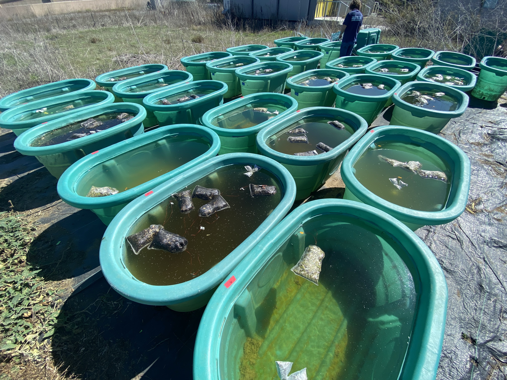

### Project overview
The goal of the Pyromania project is to test how terrestrial subsides (plant biomass loading) and burning influence aquatic productivity, trophic transfer, and water quality/chemistry. We used a manipulative experiment to assess a range of plant material quantities (0-400g/tank) and fire treatment (burned vs unburned material) and the non-linearity of these effects on aquatic systems through 4 time-point samplings. We used 400L aquatic mesocosms and ran the experiment for ~90d in 2021-2022.  


{width=70%}
**DATA SETS**  
This data set is among 3 to be generated for the project and focuses on:  

(1) **dissolved organic carbon** (DOC) and  
(2) **total dissolved nitrogen (TDN)** concentrations  
(3) **net ecosystem productivity and respiration** (NEP, NER) using whole mesocosm dissolved oxygen (O2) measurements  
(4) **burning effects on donor plant material** using elemental analysis  
(5) **greenhouse gas emissions** (methane (CH4), carbon dioxide (CO2)) from mesocosms    
(6) **trophic transfer** using 15N-labeled sage plants to trace N from the plants into plankton.    

```{r setup chunk, setup, include = FALSE, cache=FALSE, message=FALSE, warning=FALSE}
if (!require('knitr')) install.packages('knitr'); library('knitr')
knitr::opts_chunk$set(warning=FALSE, message=FALSE, fig.align='center')


######### load in packages and set global settings


# load packages
if (!require("pacman")) install.packages("pacman") # for rapid install if not in library

# use pacman to load all the packages you are missing!
pacman::p_load('knitr', 'lme4', 'lmerTest', 'tidyverse', 'magrittr', 'effects', 'plyr', 'dplyr', 'plotrix', 'car',"gridExtra", "cowplot", "tools", "mgcv", "gratia", "MASS", "stats", "tidymv", "sjstats", "coin")

```


###DOC  
import and do a loop to clean up all files and make stacked data in single df
```{r DOC import}
## import treatment IDs
IDs<-read.csv("data/treatment.IDs.csv")

##### grab files in a list
Total.DOC.files <- list.files(path="data/DOC.TN", pattern = "csv$", full.names = T)
Total.DOC.files

##### what are the file names, sans extensions using package 'tools'
file.names<-file_path_sans_ext(list.files(path="data/DOC.TN", pattern = "csv$", full.names = F))
file.names
############ formatting all data in for loop
  for(i in 1:length(Total.DOC.files))
    {
  data<-read.csv(Total.DOC.files[i], sep=",")
  data<-data[,c(1,3,4)] # removed columns we don't need
  data$File<-Total.DOC.files[i]
  colnames(data)<-c("Tank", "DOC..mg.L", "TN..mg.L", "File")
  data$Tank<- IDs$Tank
  data$Tank<-as.numeric(as.character(data$Tank)) # make the column of samples all numeric
  data <- data[!is.na(as.numeric(as.character(data$Tank))),] # remove all rows that aren't numeric/tanks
  data$Treatment<-IDs$Treatment
  data$plant.mass..g<-IDs$plant.mass..g
  make.names(assign(paste(file.names[i], sep=""), data)) # make the file name the name of new df for loop df
  }
########## this is the end of the loop


ls() #see all dfs you've made, the above will be df matching their file names

#Combine files from loop to single df
DOC.df<-rbind(DOC_T0, DOC_T1, DOC_T2, DOC_T3, DOC_T4)

DOC.df$File <- sapply(strsplit(DOC.df$File, "/"), `[`, 3) # extract sample names

# alternative way to code the above
#give the 10th-24th character of the file name, removing the rest
#DOC.df$File<-substr(DOC.df$File, 13, 27) 

#alternatively
# remove the 9 letters ('^.) at start 
# remove the 4 letters (.$') at end
#DOC.df$File<-gsub('^.........|....$', '', DOC.df$File) 

# if equals DOC_T0_11052021 then, T0, if not then T1
DOC.df$Time.point<- as.factor(ifelse(DOC.df$File=="DOC_T0.csv", "T0",
         ifelse (DOC.df$File=="DOC_T1.csv", "T1",
           ifelse (DOC.df$File=="DOC_T2.csv", "T2", 
                   ifelse(DOC.df$File=="DOC_T3.csv", "T3", "T4")))))

#rearrange
DOC.df<- DOC.df %>% 
  select(File, Time.point, Treatment, Tank, plant.mass..g, DOC..mg.L, TN..mg.L) 

DOC.df$Treatment<-as.factor(DOC.df$Treatment)
```

DOC analysis: 

- notes on GAMS....
Note that fitting via restricted maximum likelihood (REML) is advised to give stable results. Fitting the smoothing parameter (sp) to user defined levels not advisable (but certainly is done). 
Number of basis functions important as well, small # of basis functions (k) will limit wiggliness (and make the model more linear than should be). This wiggliness is set by using the k values. Don't want too high, or too low... 

When using the non-linear smoothing, this is the s(xxxx). Can add a new predictor by adding another smooth function with s(x1) + s(x2). When the variable is inside the smooth function, this is to account for the nonlinear shape. Two smoothing together and you have ADDITIVE Nonlinear modeling. Not all variables need to be non-linear, but adding a predictor outside of the s() then this is allowing for linearity. 

In practice, continuous variables are rarely linear in GAMs, automatic smoothing will make a linear shape if setting high smoothing function (ie.. s =1000), then a non-linear variable appears linear. However, setting categorical variables as predicots linear is more common.

Factor-smooth interaction also an option, this is when s(x1 by = fac), this sets different smoothing for different variables of "fac". Usually, the different smoothers are combined with a varying intercept incase the different categories are different in means and slopes, this would be by adding the s(x1 by = fac) + fac, wheere the +fac allows for a different slope

EDF - effective degrees of freedom, equate with wiggliness, with edf =1 as a straight line, and higher edfs as more wiggly. GAM smoother significance is described as not being able to draw a horizontal line through the data. Always check concurvity, which is the collinearity with models from 0-1.

```{r DOC analysis and individual plots}

######## T0 model
m1.DOC.T0.gam=gam(DOC..mg.L ~ Treatment + s(plant.mass..g, by= Treatment), subset = Time.point=="T0", data = DOC.df, method = "REML")

m2.DOC.T0.gam=gam(DOC..mg.L ~  Treatment + s(plant.mass..g), subset = Time.point=="T0", data = DOC.df, method = "REML")

m3.DOC.T0.gam=gam(DOC..mg.L ~  s(plant.mass..g), subset = Time.point=="T0", data = DOC.df, method = "REML")

T0.DOC.AIC<-AIC(m1.DOC.T0.gam, m2.DOC.T0.gam, m3.DOC.T0.gam)
# best is smoother solo

summary(m3.DOC.T0.gam)
anova.gam(m3.DOC.T0.gam)
gam.check(m3.DOC.T0.gam, rep=1000)
draw(m3.DOC.T0.gam)
concrvity(m3.DOC.T0.gam)
par(mfrow = c(2, 2))
plot(m3.DOC.T0.gam, all.terms = TRUE, page=1)

# model predictions
DOC.diff.T0<-plot_difference(
  m1.DOC.T0.gam,
  series = plant.mass..g,
  difference = list(Treatment = c("burned", "unburned"))
)

###########  
#plot for the model output on rawdata
DOC.T0.mod.plot<-
  plot_smooths(
  model = m3.DOC.T0.gam,
  series = plant.mass..g,
) + 
  geom_point(data=DOC.df[(DOC.df$Time.point=="T0"),], 
             aes(x=plant.mass..g, y=DOC..mg.L, color=Treatment)) +
  scale_color_manual(values = c("brown1", "mediumseagreen")) + 
  coord_cartesian(ylim=c(0, 5)) +
  ggtitle("Day-0") +
  ylab("DOC (mg/L)") +
  xlab("plant material (g)") +
  Fig.formatting


######## T1 model
m1.DOC.T1.gam=gam(DOC..mg.L ~ Treatment + s(plant.mass..g, by= Treatment), subset = Time.point=="T1", data = DOC.df, method = "REML")

m2.DOC.T1.gam=gam(DOC..mg.L ~  Treatment + s(plant.mass..g), subset = Time.point=="T1", data = DOC.df, method = "REML")

m3.DOC.T1.gam=gam(DOC..mg.L ~  s(plant.mass..g), subset = Time.point=="T1", data = DOC.df, method = "REML")

T1.DOC.AIC<-AIC(m1.DOC.T1.gam, m2.DOC.T1.gam, m3.DOC.T1.gam)
# best is smooth by factor

summary(m1.DOC.T1.gam)
anova.gam(m1.DOC.T1.gam)
gam.check(m1.DOC.T1.gam, rep=1000)
draw(m1.DOC.T1.gam)
concrvity(m1.DOC.T1.gam)
par(mfrow = c(2, 2))
plot(m1.DOC.T1.gam, all.terms = TRUE, page=1)

# model predictions
DOC.diff.T1<-plot_difference(
  m1.DOC.T1.gam,
  series = plant.mass..g,
  difference = list(Treatment = c("burned", "unburned"))
)

###########  
#plot for the model output on rawdata
DOC.T1.mod.plot<-
  plot_smooths(
  model = m1.DOC.T1.gam,
  series = plant.mass..g,
  comparison = Treatment
) + 
  geom_point(data=DOC.df[(DOC.df$Time.point=="T1"),], 
             aes(x=plant.mass..g, y=DOC..mg.L, color=Treatment)) +
  scale_color_manual(values = c("brown1", "mediumseagreen")) + 
  coord_cartesian(ylim=c(0, 60)) +
  ggtitle("Day-10") +
  ylab("DOC (mg/L)") +
  xlab("plant material (g)") +
  Fig.formatting


# effect of treatment, smoothing significant across both treatments
# DOC higher in  unburned, relative to burned


########## T2
m1.DOC.T2.gam=gam(DOC..mg.L ~ Treatment + s(plant.mass..g, by= Treatment), subset = Time.point=="T2", data = DOC.df, method = "REML")

m2.DOC.T2.gam=gam(DOC..mg.L ~  Treatment + s(plant.mass..g), subset = Time.point=="T2", data = DOC.df, method = "REML")

m3.DOC.T2.gam=gam(DOC..mg.L ~  s(plant.mass..g), subset = Time.point=="T2", data = DOC.df, method = "REML")

T2.DOC.AIC<-AIC(m1.DOC.T2.gam, m2.DOC.T2.gam, m3.DOC.T2.gam)

# best is smooth by factor

summary(m1.DOC.T2.gam)
anova.gam(m1.DOC.T2.gam)
gam.check(m1.DOC.T2.gam, rep=1000)
draw(m1.DOC.T2.gam)
concrvity(m1.DOC.T2.gam)
par(mfrow = c(2, 2))
plot(m1.DOC.T2.gam, all.terms = TRUE, page=1)

# model predictions
DOC.diff.T2<-plot_difference(
  m1.DOC.T2.gam,
  series = plant.mass..g,
  difference = list(Treatment = c("burned", "unburned"))
)

###########  
#plot for the model output on rawdata
DOC.T2.mod.plot<-
  plot_smooths(
  model = m1.DOC.T2.gam,
  series = plant.mass..g,
  comparison = Treatment
) + 
  geom_point(data=DOC.df[(DOC.df$Time.point=="T2"),], 
             aes(x=plant.mass..g, y=DOC..mg.L, color=Treatment)) +
  scale_color_manual(values = c("brown1", "mediumseagreen")) + 
  coord_cartesian(ylim=c(0, 60)) +
  ggtitle("Day-31") +
  ylab("DOC (mg/L)") +
  xlab("plant material (g)") +
  Fig.formatting

# NO effect of treatment, smoothing significant across both treatments
# DOC equivalent in burned and unburned 
# DOC more variable/wonky across gradient in burned


########## T3
m1.DOC.T3.gam=gam(DOC..mg.L ~ Treatment + s(plant.mass..g, by= Treatment), subset = Time.point=="T3", data = DOC.df, method = "REML")

m2.DOC.T3.gam=gam(DOC..mg.L ~  Treatment + s(plant.mass..g), subset = Time.point=="T3", data = DOC.df, method = "REML")

m3.DOC.T3.gam=gam(DOC..mg.L ~  s(plant.mass..g), subset = Time.point=="T3", data = DOC.df, method = "REML")

T3.DOC.AIC<-AIC(m1.DOC.T3.gam, m2.DOC.T3.gam, m3.DOC.T3.gam)
# best by factor smooth

summary(m1.DOC.T3.gam)
anova.gam(m1.DOC.T3.gam)
gam.check(m1.DOC.T3.gam, rep=1000)
draw(m1.DOC.T3.gam)
concrvity(m1.DOC.T3.gam)
par(mfrow = c(2, 2))
plot(m1.DOC.T3.gam, all.terms = TRUE, page=1)

# model predictions
DOC.diff.T3<-plot_difference(
  m1.DOC.T3.gam,
  series = plant.mass..g,
  difference = list(Treatment = c("burned", "unburned"))
)

###########  
#plot for the model output on rawdata
DOC.T3.mod.plot<-
  plot_smooths(
  model = m1.DOC.T3.gam,
  series = plant.mass..g,
  comparison = Treatment
) + 
  geom_point(data=DOC.df[(DOC.df$Time.point=="T3"),], 
             aes(x=plant.mass..g, y=DOC..mg.L, color=Treatment)) +
  scale_color_manual(values = c("brown1", "mediumseagreen")) + 
  coord_cartesian(ylim=c(0, 60)) +
  ggtitle("Day-59") +
  ylab("DOC (mg/L)") +
  xlab("plant material (g)") +
  Fig.formatting

# effect of treatment, smoothing significant across both treatments
# DOC higher in  burned vs. unburned


########## T4
m1.DOC.T4.gam=gam(DOC..mg.L ~ Treatment + s(plant.mass..g, by= Treatment), subset = Time.point=="T4", data = DOC.df, method = "REML")

m2.DOC.T4.gam=gam(DOC..mg.L ~  Treatment + s(plant.mass..g), subset = Time.point=="T4", data = DOC.df, method = "REML")

m3.DOC.T4.gam=gam(DOC..mg.L ~  s(plant.mass..g), subset = Time.point=="T4", data = DOC.df, method = "REML")

T4.DOC.AIC<-AIC(m1.DOC.T4.gam, m2.DOC.T4.gam, m3.DOC.T4.gam)

# best is global
summary(m3.DOC.T4.gam)
anova.gam(m3.DOC.T4.gam)
gam.check(m3.DOC.T4.gam, rep=1000)
draw(m3.DOC.T4.gam)
concrvity(m3.DOC.T4.gam)
par(mfrow = c(2, 2))
plot(m3.DOC.T4.gam, all.terms = TRUE, page=1)

###########  
#plot for the model output on rawdata
DOC.T4.mod.plot<-
  plot_smooths(
  model = m3.DOC.T4.gam,
  series = plant.mass..g
) + 
  geom_point(data=DOC.df[(DOC.df$Time.point=="T4"),], 
             aes(x=plant.mass..g, y=DOC..mg.L, color=Treatment)) +
  scale_color_manual(values = c("brown1", "mediumseagreen")) + 
  coord_cartesian(ylim=c(0, 60)) +
  ggtitle("Day-89") +
  ylab("DOC (mg/L)") +
  xlab("plant material (g)") +
  Fig.formatting

# no effect of treatment, smoothing significant across both treatments
# DOC equivalent in  burned and unburned

AIC.DOC<-bind_rows(T0.DOC.AIC, T1.DOC.AIC, T2.DOC.AIC, T3.DOC.AIC, T4.DOC.AIC)
write.csv(AIC.DOC, "output/AIC.DOC.csv")
```

compile raw plots and model-diff plots for final figures
```{r DOC model plots compiled}

# Time 0 if we want it
DOC.T0.mod.plot

###### compile the plots with effect plots

extract.legend <- get_legend(
  # create some space to the left of the legend
  DOC.T1.mod.plot + theme(legend.box.margin = margin(0, 0, 0, 10)))


DOC.alltimes<-plot_grid(
  DOC.T1.mod.plot+ theme(legend.position = "none"),
  DOC.T2.mod.plot+ theme(legend.position = "none"),
  DOC.T3.mod.plot+ theme(legend.position = "none"),
  DOC.T4.mod.plot+ theme(legend.position = "none"), extract.legend,
  rel_widths = c(8,8,8,8,3), ncol=5)
ggsave("figures/DOC.alltimes.mod.pdf", height=4, width=12)

DOC.mod.diffs<-plot_grid(
  DOC.diff.T1+ theme(legend.position = "none")+ ggtitle("DOC - Day-10"),
  DOC.diff.T2+ theme(legend.position = "none")+ ggtitle("Day-31"),
  DOC.diff.T3+ theme(legend.position = "none")+ ggtitle("Day-59"),
  DOC.diff.T4+ theme(legend.position = "none")+ ggtitle("Day-89"),
  rel_widths = c(8,8,8,8), ncol=4)
ggsave("figures/DOC.mod.diffs.pdf", height=4, width=12)
```

### Total N
Total N analysis and plots, running models and making model-diff plots
```{r TN analysis and individual plots}
TN.df<-DOC.df

######## T0 model
m1.TN.T0.gam=gam(TN..mg.L ~ Treatment + s(plant.mass..g, by=Treatment), 
              subset = Time.point=="T0", data = TN.df, method = "REML")

m2.TN.T0.gam=gam(TN..mg.L ~ Treatment + s(plant.mass..g), 
              subset = Time.point=="T0", data = TN.df, method = "REML")

m3.TN.T0.gam=gam(TN..mg.L ~ s(plant.mass..g), 
              subset = Time.point=="T0", data = TN.df, method = "REML")

T0.TN.AIC<-AIC(m1.TN.T0.gam, m2.TN.T0.gam, m3.TN.T0.gam)
# best smooth by factor

summary(m1.TN.T0.gam)
anova.gam(m1.TN.T0.gam)
gam.check(m1.TN.T0.gam, rep=1000)
draw(m1.TN.T0.gam)
concrvity(m1.TN.T0.gam)
par(mfrow = c(2, 2))
plot(m1.TN.T0.gam, all.terms = TRUE, page=1)

# model predictions
TN.diff.T0<-plot_difference(
  m1.TN.T0.gam,
  series = plant.mass..g,
  difference = list(Treatment = c("burned", "unburned"))
)

## plot for the model output on rawdata
TN.T0.mod.plot<-
  plot_smooths(
  model = m1.TN.T0.gam,
  series = plant.mass..g,
  comparison = Treatment
) + 
  geom_point(data=TN.df[(TN.df$Time.point=="T0"),], 
             aes(x=plant.mass..g, y=TN..mg.L, color=Treatment)) +
  scale_color_manual(values = c("brown1", "mediumseagreen")) +  
  coord_cartesian(ylim=c(0, 2)) +
  ggtitle("Day-0") +
  ylab("TN (mg/L)")  +
  xlab("plant material (g)") +
  Fig.formatting

# no treatment effect, compare to simplified model (p=0.901)

######## T1 model
m1.TN.T1.gam=gam(TN..mg.L ~ Treatment + s(plant.mass..g, by=Treatment), 
              subset = Time.point=="T1", data = TN.df, method = "REML")

m2.TN.T1.gam=gam(TN..mg.L ~ Treatment + s(plant.mass..g), 
              subset = Time.point=="T1", data = TN.df, method = "REML")

m3.TN.T1.gam=gam(TN..mg.L ~ s(plant.mass..g), 
              subset = Time.point=="T1", data = TN.df, method = "REML")

T1.TN.AIC<-AIC(m1.TN.T1.gam, m2.TN.T1.gam, m3.TN.T1.gam)
#best global only

summary(m3.TN.T1.gam)
anova.gam(m3.TN.T1.gam)
gam.check(m3.TN.T1.gam, rep=1000)
draw(m3.TN.T1.gam)
concrvity(m3.TN.T1.gam)
par(mfrow = c(2, 2))
plot(m3.TN.T1.gam, all.terms = TRUE, page=1)

# model predictions
TN.diff.T1<-plot_difference(
  m1.TN.T1.gam,
  series = plant.mass..g,
  difference = list(Treatment = c("burned", "unburned"))
)

## plot for the model output on rawdata
TN.T1.mod.plot<-
  plot_smooths(
  model = m3.TN.T1.gam,
  series = plant.mass..g
) + 
  geom_point(data=TN.df[(TN.df$Time.point=="T1"),], 
             aes(x=plant.mass..g, y=TN..mg.L, color=Treatment)) +
  scale_color_manual(values = c("brown1", "mediumseagreen")) +  
  coord_cartesian(ylim=c(0, 2)) +
  ggtitle("Day-10") +
  ylab("TN (mg/L)")  +
  xlab("plant material (g)") +
  Fig.formatting

# TN smoother significant for unburned but not burned (p=0.007)


######## T2 model
m1.TN.T2.gam=gam(TN..mg.L ~ Treatment + s(plant.mass..g, by=Treatment), 
              subset = Time.point=="T2", data = TN.df, method = "REML")

m2.TN.T2.gam=gam(TN..mg.L ~ Treatment + s(plant.mass..g), 
              subset = Time.point=="T2", data = TN.df, method = "REML")

m3.TN.T2.gam=gam(TN..mg.L ~ s(plant.mass..g), 
              subset = Time.point=="T2", data = TN.df, method = "REML")

T2.TN.AIC<-AIC(m1.TN.T2.gam, m2.TN.T2.gam, m3.TN.T2.gam)
#best global with treatment term

summary(m2.TN.T2.gam)
anova.gam(m2.TN.T2.gam)
gam.check(m2.TN.T2.gam, rep=1000)
draw(m2.TN.T2.gam)
concrvity(m2.TN.T2.gam)
par(mfrow = c(2, 2))
plot(m2.TN.T2.gam, all.terms = TRUE, page=1)

# model predictions
TN.diff.T2<-plot_difference(
  m1.TN.T2.gam,
  series = plant.mass..g,
  difference = list(Treatment = c("burned", "unburned"))
)

## plot for the model output on rawdata
TN.T2.mod.plot<-
  plot_smooths(
  model = m3.TN.T2.gam,
  series = plant.mass..g
) + 
  geom_point(data=TN.df[(TN.df$Time.point=="T2"),], 
             aes(x=plant.mass..g, y=TN..mg.L, color=Treatment)) +
  scale_color_manual(values = c("brown1", "mediumseagreen")) +  
  coord_cartesian(ylim=c(0, 2)) +
  ggtitle("Day-31") +
  ylab("TN (mg/L)")  +
  xlab("plant material (g)") +
  Fig.formatting

# Near treatment effect p=0.053, higher TN in unburned
# smoother signif: 0.042


######## T3 model
m1.TN.T3.gam=gam(TN..mg.L ~ Treatment + s(plant.mass..g, by=Treatment), 
              subset = Time.point=="T3", data = TN.df, method = "REML")

m2.TN.T3.gam=gam(TN..mg.L ~ Treatment + s(plant.mass..g), 
              subset = Time.point=="T3", data = TN.df, method = "REML")

m3.TN.T3.gam=gam(TN..mg.L ~ s(plant.mass..g), 
              subset = Time.point=="T3", data = TN.df, method = "REML")

T3.TN.AIC<-AIC(m1.TN.T3.gam, m2.TN.T3.gam, m3.TN.T3.gam)
#best with smooth by factor term

summary(m1.TN.T3.gam)
anova.gam(m1.TN.T3.gam)
gam.check(m1.TN.T3.gam, rep=1000)
draw(m1.TN.T3.gam)
concrvity(m1.TN.T3.gam)
par(mfrow = c(2, 2))
plot(m1.TN.T3.gam, all.terms = TRUE, page=1)

# model predictions
TN.diff.T3<-plot_difference(
  m1.TN.T3.gam,
  series = plant.mass..g,
  difference = list(Treatment = c("burned", "unburned"))
)

## plot for the model output on rawdata
TN.T3.mod.plot<-
  plot_smooths(
  model = m1.TN.T3.gam,
  series = plant.mass..g,
  comparison = Treatment
) + 
  geom_point(data=TN.df[(TN.df$Time.point=="T3"),], 
             aes(x=plant.mass..g, y=TN..mg.L, color=Treatment)) +
  scale_color_manual(values = c("brown1", "mediumseagreen")) +  
  coord_cartesian(ylim=c(0, 2)) +
  ggtitle("Day-59") +
  ylab("TN (mg/L)")  +
  xlab("plant material (g)") +
  Fig.formatting

# Near treatment effect p=0.075, trend for higher TN in burned
# smoother signif: at <0.001 for both


######## T4 model
m1.TN.T4.gam=gam(TN..mg.L ~ Treatment + s(plant.mass..g, by=Treatment), 
              subset = Time.point=="T4", data = TN.df, method = "REML")

m2.TN.T4.gam=gam(TN..mg.L ~ Treatment + s(plant.mass..g), 
              subset = Time.point=="T4", data = TN.df, method = "REML")

m3.TN.T4.gam=gam(TN..mg.L ~ s(plant.mass..g), 
              subset = Time.point=="T4", data = TN.df, method = "REML")

T4.TN.AIC<-AIC(m1.TN.T4.gam, m2.TN.T4.gam, m3.TN.T4.gam)
#best  with smooth by factor term

summary(m1.TN.T4.gam)
anova.gam(m1.TN.T4.gam)
gam.check(m1.TN.T4.gam, rep=1000)
draw(m1.TN.T4.gam)
concrvity(m1.TN.T4.gam)
par(mfrow = c(2, 2))
plot(m1.TN.T4.gam, all.terms = TRUE, page=1)

# model predictions
TN.diff.T4<-plot_difference(
  m1.TN.T4.gam,
  series = plant.mass..g,
  difference = list(Treatment = c("burned", "unburned"))
)

## plot for the model output on rawdata
TN.T4.mod.plot<-
  plot_smooths(
  model = m1.TN.T4.gam,
  series = plant.mass..g,
  comparison = Treatment
) + 
  geom_point(data=TN.df[(TN.df$Time.point=="T4"),], 
             aes(x=plant.mass..g, y=TN..mg.L, color=Treatment)) +
  scale_color_manual(values = c("brown1", "mediumseagreen")) +  
  coord_cartesian(ylim=c(0, 2)) +
  ggtitle("Day-89") +
  ylab("TN (mg/L)")  +
  xlab("plant material (g)") +
  Fig.formatting


# effect of treatment (higher TN in the burned) (p=0.020)
# significant smoother effect for burned treatment only (p=0.032)

AIC.TN<-bind_rows(T0.TN.AIC, T1.TN.AIC, T2.TN.AIC, T3.TN.AIC, T4.TN.AIC)
write.csv(AIC.TN, "output/AIC.TN.csv")


```

compile plots
```{r TN plots compiled}
###### compile the plots with effect plots
TN.T0.mod.plot # if we want it

TN.mod.alltimes<-plot_grid(
  TN.T1.mod.plot+ theme(legend.position = "none"),
  TN.T2.mod.plot+ theme(legend.position = "none"),
  TN.T3.mod.plot+ theme(legend.position = "none"),
  TN.T4.mod.plot+ theme(legend.position = "none"), extract.legend,
  rel_widths = c(8,8,8,8,3), ncol=5)
ggsave("figures/TN.mods.plots.pdf", height=5, width=14)

TN.mod.diffs<-plot_grid(
  TN.diff.T1+ theme(legend.position = "none")+ ggtitle("Day-10"),
  TN.diff.T2+ theme(legend.position = "none")+ ggtitle("Day-31"),
  TN.diff.T3+ theme(legend.position = "none")+ ggtitle("Day-59"),
  TN.diff.T4+ theme(legend.position = "none")+ ggtitle("Day-89"),
  rel_widths = c(8,8,8,8,3), ncol=5)
ggsave("figures/TN.mod.diffs.pdf", height=4, width=13)
```

###YSI  
Import YSI data and produce plots of changes in O2% and net ecosystem productivity (NEP) and net ecosystem respiration (NER)  
```{r YSI organized}
#load YSI data
YSI<-read.csv("data/Pyro_YSI.csv")

# fix date
YSI$Date<-as.character(YSI$Date)
YSI$Date<-as.POSIXct(YSI$Date, format="%m/%d/%Y")
YSI$Date<-as.Date(YSI$Date, format="%m/%d/%Y")


####### Time 1 change in O2 ################

#separate time points
YSI.T1<- YSI[(YSI$Time.point=="T1"),]

#calculate NEP for T1
T1.Prod<-YSI.T1[(YSI.T1$Date == "2021-11-15"),] # dawn and dusk for 12h period
T1.Dawn1<-T1.Prod[(T1.Prod$Dawn..Dusk == "dawn"),] # dawn-1 measurements
T1.Dusk<-T1.Prod[(T1.Prod$Dawn..Dusk == "dusk"),] # dusk measurements

T1.Dawn2<-YSI.T1[(YSI.T1$Date == "2021-11-16"),] # dawn-2 measurements, following AM

# make new dataframe
T1.O2<-(T1.Dawn1[,c(2,4:6)]) 
T1.O2$dawn1<-T1.Dawn1$DO.percent
T1.O2$dusk1<-T1.Dusk$DO.percent
T1.O2$dawn2<-T1.Dawn2$DO.percent

# NER = dusk - dawn (PM to AM, O2 change of day 1)
# NEP = dusk - dawn (PM to AM, O2 change of day 2)

T1.O2<- mutate(T1.O2, 
                NEP=dusk1 - dawn1,
                NER=dawn2 - dusk1) 

#sort
T1.O2<-T1.O2 %>% 
  arrange(Treatment, plant.mass..g) 


################ ################ ################
####### Time 2 change in O2 ################

#separate time points
YSI.T2<- YSI[(YSI$Time.point=="T2"),]

#calculate NEP for T2
T2.Prod<-YSI.T2[(YSI.T2$Date == "2021-12-06"),] # dawn and dusk for 12h period
T2.Dawn1<-T2.Prod[(T2.Prod$Dawn..Dusk == "dawn"),] # dawn-1 measurements
T2.Dusk<-T2.Prod[(T2.Prod$Dawn..Dusk == "dusk"),] # dusk measurements

T2.Dawn2<-YSI.T2[(YSI.T2$Date == "2021-12-07"),] # dawn-2 measurements, following AM

# make new dataframe
T2.O2<-(T2.Dawn1[,c(2,4:6)]) 
T2.O2$dawn1<-T2.Dawn1$DO.percent
T2.O2$dusk1<-T2.Dusk$DO.percent
T2.O2$dawn2<-T2.Dawn2$DO.percent

T2.O2<- mutate(T2.O2, 
                NEP=dusk1 - dawn1,
                NER=dawn2 - dusk1) 

#sort
T2.O2<-T2.O2 %>% 
  arrange(Treatment, plant.mass..g) 


################ ################ ################
####### Time 3 change in O2 ################

#separate time points
YSI.T3<- YSI[(YSI$Time.point=="T3"),]

#calculate NEP for T3
T3.Prod<-YSI.T3[(YSI.T3$Date == "2022-01-03"),] # dawn and dusk for 12h period
T3.Dawn1<-T3.Prod[(T3.Prod$Dawn..Dusk == "dawn"),] # dawn-1 measurements
T3.Dusk<-T3.Prod[(T3.Prod$Dawn..Dusk == "dusk"),] # dusk measurements

T3.Dawn2<-YSI.T3[(YSI.T3$Date == "2022-01-04"),] # dawn-2 measurements, following AM

# make new dataframe
T3.O2<-(T3.Dawn1[,c(2,4:6)]) 
T3.O2$dawn1<-T3.Dawn1$DO.percent
T3.O2$dusk1<-T3.Dusk$DO.percent
T3.O2$dawn2<-T3.Dawn2$DO.percent

T3.O2<- mutate(T3.O2, 
                NEP=dusk1 - dawn1,
                NER=dawn2 - dusk1) 

#sort
T3.O2<-T3.O2 %>% 
  arrange(Treatment, plant.mass..g) 

################ ################ ################
####### Time 3 change in O2 ################

#separate time points
YSI.T4<- YSI[(YSI$Time.point=="T4"),]

#calculate NEP for T4
T4.Prod<-YSI.T4[(YSI.T4$Date == "2022-02-02"),] # dawn and dusk for 12h period
T4.Dawn1<-T4.Prod[(T4.Prod$Dawn..Dusk == "dawn"),] # dawn-1 measurements
T4.Dusk<-T4.Prod[(T4.Prod$Dawn..Dusk == "dusk"),] # dusk measurements

T4.Dawn2<-YSI.T4[(YSI.T4$Date == "2022-02-03"),] # dawn-2 measurements, following AM

# make new dataframe
T4.O2<-(T4.Dawn1[,c(2,4:6)]) 
T4.O2$dawn1<-T4.Dawn1$DO.percent
T4.O2$dusk1<-T4.Dusk$DO.percent
T4.O2$dawn2<-T4.Dawn2$DO.percent

T4.O2<- mutate(T4.O2, 
                NEP=dusk1 - dawn1,
                NER=dawn2 - dusk1) 

#sort
T4.O2<-T4.O2 %>% 
  arrange(Treatment, plant.mass..g) 

################ ################ ################
# combine T1  T2  T3 T4 timepoints
################ ################ ################
O2.tanks<-rbind(T1.O2,T2.O2, T3.O2, T4.O2)

cols<-c("Time.point", "Treatment", "Tank") # columns to make factors
O2.tanks[cols] <- lapply(O2.tanks[cols], factor) # make all these factors
O2.tanks$plant.mass..g<-as.numeric(O2.tanks$plant.mass..g)
```
  
TIME POINT 1: Change in O2% and NEP and NER --   
make figures of the data for timepoint 1  
```{r Time1 O2}
########## 
Fig.formatting<-(theme_classic()) +
  theme(text=element_text(size=10),
        axis.line=element_blank(),
        legend.text.align = 0,
        legend.text=element_text(size=10),
        #legend.title = element_blank(),
        panel.border = element_rect(fill=NA, colour = "black", size=1),
        aspect.ratio=1, 
        axis.ticks.length=unit(0.25, "cm"),
        axis.text.y=element_text(
          margin=unit(c(0.5, 0.5, 0.5, 0.5), "cm"), colour="black", size=10), 
        axis.text.x=element_text(
          margin=unit(c(0.5, 0.5, 0.5, 0.5), "cm"), colour="black", size=8)) +
  theme(legend.key.size = unit(0.4, "cm")) +
  theme(aspect.ratio=1.3) +
  theme(panel.spacing=unit(c(0, 0, 0, 0), "cm"))

#########################################################
############################################################################


# total oxygen % plot for the 3 time points (dawn-dusk-dawn)

T1.AM1<-ggplot(T1.O2, aes(x=plant.mass..g, y=dawn1, color=Treatment)) + 
  geom_point() +
  scale_color_manual(values = c("brown1", "mediumseagreen")) + 
  geom_smooth(method=loess, aes(fill=Treatment), alpha=0.1) +
  geom_hline(yintercept=0, linetype="longdash", color = "gray") +
  ggtitle("T1.dawn1")+
  coord_cartesian(ylim=c(-30, 150)) +
  ylab(expression(paste("O"[2],"%"))) +
  xlab("plant material (g)") +
  Fig.formatting

T1.PM1<-ggplot(T1.O2, aes(x=plant.mass..g, y=dusk1, color=Treatment)) + 
  geom_point() +
  scale_color_manual(values = c("brown1", "mediumseagreen")) + 
  geom_smooth(method=loess, aes(fill=Treatment), alpha=0.1) +
  geom_hline(yintercept=0, linetype="longdash", color = "gray") +
  ggtitle("T1.dusk1")+
  coord_cartesian(ylim=c(-30, 150)) +
  ylab(expression(paste("O"[2],"%"))) +
  xlab("plant material (g)") +
  Fig.formatting

T1.AM2<-ggplot(T1.O2, aes(x=plant.mass..g, y=dawn2, color=Treatment)) + 
  geom_point() +
  scale_color_manual(values = c("brown1", "mediumseagreen")) + 
  geom_smooth(method=loess, aes(fill=Treatment), alpha=0.1) +
  geom_hline(yintercept=0, linetype="longdash", color = "gray") +
  ggtitle("T1.dawn2")+
  coord_cartesian(ylim=c(-30, 150)) +
  ylab(expression(paste("O"[2],"%"))) +
  xlab("plant material (g)") +
  Fig.formatting

extract.legend <- get_legend(
  # create some space to the left of the legend
  T1.AM1 + theme(legend.box.margin = margin(0, 0, 0, 10)))

O2.T1<-plot_grid(
  T1.AM1+ theme(legend.position = "none"), 
  T1.PM1+ theme(legend.position = "none"), 
  T1.AM2+ theme(legend.position = "none"),
  extract.legend, 
  rel_widths = c(8,8,8,3), ncol=4)

#ggsave("figures/O2.T1.pdf", height=5, width=9)

#################################
############################################
# net ecosystem production and respiration

#Time 1 NEP
NEP.T1<-ggplot(T1.O2, aes(x=plant.mass..g, y=NEP, color=Treatment)) + 
  geom_point() +
  scale_color_manual(values = c("brown1", "mediumseagreen")) + 
  geom_smooth(method=loess, aes(fill=Treatment), alpha=0.1) +
  geom_hline(yintercept=0, linetype="longdash", color = "gray") +
  ylab(expression(paste("Net Production (", Delta, "O"[2],"%)"))) +
  coord_cartesian(ylim=c(-20, 50)) +
  xlab("plant material (g)")+
  Fig.formatting

#Time 1 NER
NER.T1<-ggplot(T1.O2, aes(x=plant.mass..g, y=NER, color=Treatment)) + 
  geom_point() +
  scale_color_manual(values = c("brown1", "mediumseagreen")) + 
  geom_smooth(method=loess, aes(fill=Treatment), alpha=0.1) +
  geom_hline(yintercept=0, linetype="longdash", color = "gray") +
  coord_cartesian(ylim=c(-40, 10)) +
  ylab(expression(paste("Net Respiration (", Delta, "O"[2],"%)"))) +
  xlab("plant material (g)") +
  Fig.formatting


O2.change.T1<-plot_grid(
  NEP.T1+ theme(legend.position = "none") + ggtitle("Time 1"), 
  NER.T1+ theme(legend.position = "none") + ggtitle(""),
  extract.legend, 
  rel_widths = c(8,8,3), ncol=3)

#ggsave("figures/O2.change.T1.pdf", height=5, width=8)
```
  
TIME POINT 2: Change in O2% and NEP and NER --
make figures of the data for timepoint 2
```{r Time2 O2}
############################################################
##############################################################################


# total oxygen % plot for the 3 time points (dawn-dusk-dawn)

T2.AM1<-ggplot(T2.O2, aes(x=plant.mass..g, y=dawn1, color=Treatment)) + 
  geom_point() +
  scale_color_manual(values = c("brown1", "mediumseagreen")) + 
  geom_smooth(method=loess, aes(fill=Treatment), alpha=0.1) +
  geom_hline(yintercept=0, linetype="longdash", color = "gray") +
  ggtitle("T2.dawn1")+
  coord_cartesian(ylim=c(-30, 150)) +
  ylab(expression(paste("O"[2],"%"))) +
  xlab("plant material (g)") +
  Fig.formatting

T2.PM1<-ggplot(T2.O2, aes(x=plant.mass..g, y=dusk1, color=Treatment)) + 
  geom_point() +
  scale_color_manual(values = c("brown1", "mediumseagreen")) + 
  geom_smooth(method=loess, aes(fill=Treatment), alpha=0.1) +
  geom_hline(yintercept=0, linetype="longdash", color = "gray") +
  ggtitle("T2.dusk1")+
  coord_cartesian(ylim=c(-30, 150)) +
  ylab(expression(paste("O"[2],"%"))) +
  xlab("plant material (g)") +
  Fig.formatting

T2.AM2<-ggplot(T2.O2, aes(x=plant.mass..g, y=dawn2, color=Treatment)) + 
  geom_point() +
  scale_color_manual(values = c("brown1", "mediumseagreen")) + 
  geom_smooth(method=loess, aes(fill=Treatment), alpha=0.1) +
  geom_hline(yintercept=0, linetype="longdash", color = "gray") +
  ggtitle("T2.dawn2")+
  coord_cartesian(ylim=c(-30, 150)) +
  ylab(expression(paste("O"[2],"%"))) +
  xlab("plant material (g)") +
  Fig.formatting

O2.T2<-plot_grid(
  T2.AM1+ theme(legend.position = "none"), 
  T2.PM1+ theme(legend.position = "none"),
  T2.AM2+ theme(legend.position = "none"),
  extract.legend, 
  rel_widths = c(8,8,8,3), ncol=4)

#ggsave("figures/O2.T2.pdf", height=5, width=9)


############################################################
##############################################################################################
# net ecosystem production and respiration

#Time 2 NEP
NEP.T2<-ggplot(T2.O2, aes(x=plant.mass..g, y=NEP, color=Treatment)) + 
  geom_point() +
  scale_color_manual(values = c("brown1", "mediumseagreen")) + 
  geom_smooth(method=loess, aes(fill=Treatment), alpha=0.1) +
  geom_hline(yintercept=0, linetype="longdash", color = "gray") +
  coord_cartesian(ylim=c(-20, 50)) +
  ylab(expression(paste("Net Production (", Delta, "O"[2],"%)"))) +
  xlab("plant material (g)") +
  Fig.formatting

#Time 2 NER
NER.T2<-ggplot(T2.O2, aes(x=plant.mass..g, y=NER, color=Treatment)) + 
  geom_point() +
  scale_color_manual(values = c("brown1", "mediumseagreen")) + 
  geom_smooth(method=loess, aes(fill=Treatment),alpha=0.1) +
  geom_hline(yintercept=0, linetype="longdash", color = "gray") +
  coord_cartesian(ylim=c(-40, 10)) +
  ylab(expression(paste("Net Respiration (", Delta, "O"[2],"%)"))) +
  xlab("plant material (g)") +
  Fig.formatting

O2.change.T2<-plot_grid(
  NEP.T2+ theme(legend.position = "none") + ggtitle("Time 2"),
  NER.T2+ theme(legend.position = "none") + ggtitle(""),
  extract.legend, 
  rel_widths = c(8,8,3), ncol=3)

#ggsave("figures/O2.change.T2.pdf", height=5, width=8)


```

TIME POINT 3: Change in O2% and NEP and NER --
make figures of the data for timepoint 3
```{r Time3 O2}
############################################################
##############################################################################

# total oxygen % plot for the 3 time points (dawn-dusk-dawn)

T3.AM1<-ggplot(T3.O2, aes(x=plant.mass..g, y=dawn1, color=Treatment)) + 
  geom_point() +
  scale_color_manual(values = c("brown1", "mediumseagreen")) + 
  geom_smooth(method=loess, aes(fill=Treatment), alpha=0.1) +
  geom_hline(yintercept=0, linetype="longdash", color = "gray") +
  ggtitle("T3.dawn1")+
  coord_cartesian(ylim=c(-30, 150)) +
  ylab(expression(paste("O"[2],"%"))) +
  xlab("plant material (g)") +
  Fig.formatting

T3.PM1<-ggplot(T3.O2, aes(x=plant.mass..g, y=dusk1, color=Treatment)) + 
  geom_point() +
  scale_color_manual(values = c("brown1", "mediumseagreen")) + 
  geom_smooth(method=loess, aes(fill=Treatment), alpha=0.1) +
  geom_hline(yintercept=0, linetype="longdash", color = "gray") +
  ggtitle("T3.dusk1")+
  coord_cartesian(ylim=c(-30, 150)) +
  ylab(expression(paste("O"[2],"%"))) +
  xlab("plant material (g)") +
  Fig.formatting

T3.AM2<-ggplot(T3.O2, aes(x=plant.mass..g, y=dawn2, color=Treatment)) + 
  geom_point() +
  scale_color_manual(values = c("brown1", "mediumseagreen")) + 
  geom_smooth(method=loess, aes(fill=Treatment), alpha=0.1) +
  geom_hline(yintercept=0, linetype="longdash", color = "gray") +
  ggtitle("T3.dawn2")+
  coord_cartesian(ylim=c(-30, 150)) +
  ylab(expression(paste("O"[2],"%"))) +
  xlab("plant material (g)") +
  Fig.formatting

O2.T3<-plot_grid(
  T3.AM1+ theme(legend.position = "none"), 
  T3.PM1+ theme(legend.position = "none"),
  T3.AM2+ theme(legend.position = "none"),
  extract.legend, 
  rel_widths = c(8,8,8,3), ncol=4)

#ggsave("figures/O2.T3.pdf", height=5, width=9)


############################################################
##############################################################################################
# net ecosystem production and respiration

#Time 3 NEP
NEP.T3<-ggplot(T3.O2, aes(x=plant.mass..g, y=NEP, color=Treatment)) + 
  geom_point() +
  scale_color_manual(values = c("brown1", "mediumseagreen")) + 
  geom_smooth(method=loess, aes(fill=Treatment), alpha=0.1) +
  geom_hline(yintercept=0, linetype="longdash", color = "gray") +
  coord_cartesian(ylim=c(-20, 50)) +
  ylab(expression(paste("Net Production (", Delta, "O"[2],"%)"))) +
  xlab("plant material (g)") +
  Fig.formatting

#Time 3 NER
NER.T3<-ggplot(T3.O2, aes(x=plant.mass..g, y=NER, color=Treatment)) + 
  geom_point() +
  scale_color_manual(values = c("brown1", "mediumseagreen")) + 
  geom_smooth(method=loess, aes(fill=Treatment),alpha=0.1) +
  geom_hline(yintercept=0, linetype="longdash", color = "gray") +
  coord_cartesian(ylim=c(-40, 10)) +
  ylab(expression(paste("Net Respiration (", Delta, "O"[2],"%)"))) +
  xlab("plant material (g)") +
  Fig.formatting

O2.change.T3<-plot_grid(
  NEP.T3+ theme(legend.position = "none") + ggtitle("Time 3"),
  NER.T3+ theme(legend.position = "none") + ggtitle(""),
  extract.legend, 
  rel_widths = c(8,8,3), ncol=3)

#ggsave("figures/O2.change.T3.pdf", height=5, width=8)


```
  
TIME POINT 4: Change in O2% and NEP and NER --
make figures of the data for timepoint 4
```{r Time4 O2}
############################################################
##############################################################################

# total oxygen % plot for the 3 time points (dawn-dusk-dawn)

T4.AM1<-ggplot(T4.O2, aes(x=plant.mass..g, y=dawn1, color=Treatment)) + 
  geom_point() +
  scale_color_manual(values = c("brown1", "mediumseagreen")) + 
  geom_smooth(method=loess, aes(fill=Treatment), alpha=0.1) +
  geom_hline(yintercept=0, linetype="longdash", color = "gray") +
  ggtitle("T4.dawn1")+
  coord_cartesian(ylim=c(-30, 150)) +
  ylab(expression(paste("O"[2],"%"))) +
  xlab("plant material (g)") +
  Fig.formatting

T4.PM1<-ggplot(T4.O2, aes(x=plant.mass..g, y=dusk1, color=Treatment)) + 
  geom_point() +
  scale_color_manual(values = c("brown1", "mediumseagreen")) + 
  geom_smooth(method=loess, aes(fill=Treatment), alpha=0.1) +
  geom_hline(yintercept=0, linetype="longdash", color = "gray") +
  ggtitle("T4.dusk1")+
  coord_cartesian(ylim=c(-30, 150)) +
  ylab(expression(paste("O"[2],"%"))) +
  xlab("plant material (g)") +
  Fig.formatting

T4.AM2<-ggplot(T4.O2, aes(x=plant.mass..g, y=dawn2, color=Treatment)) + 
  geom_point() +
  scale_color_manual(values = c("brown1", "mediumseagreen")) + 
  geom_smooth(method=loess, aes(fill=Treatment), alpha=0.1) +
  geom_hline(yintercept=0, linetype="longdash", color = "gray") +
  ggtitle("T4.dawn2")+
  coord_cartesian(ylim=c(-30, 150)) +
  ylab(expression(paste("O"[2],"%"))) +
  xlab("plant material (g)") +
  Fig.formatting

O2.T4<-plot_grid(
  T4.AM1+ theme(legend.position = "none"), 
  T4.PM1+ theme(legend.position = "none"),
  T4.AM2+ theme(legend.position = "none"),
  extract.legend, 
  rel_widths = c(8,8,8,3), ncol=4)

#ggsave("figures/O2.T4.pdf", height=5, width=9)


############################################################
##############################################################################################
# net ecosystem production and respiration

#Time 4 NEP
NEP.T4<-ggplot(T4.O2, aes(x=plant.mass..g, y=NEP, color=Treatment)) + 
  geom_point() +
  scale_color_manual(values = c("brown1", "mediumseagreen")) + 
  geom_smooth(method=loess, aes(fill=Treatment), alpha=0.1) +
  geom_hline(yintercept=0, linetype="longdash", color = "gray") +
  coord_cartesian(ylim=c(-20, 50)) +
  ylab(expression(paste("Net Production (", Delta, "O"[2],"%)"))) +
  xlab("plant material (g)") +
  Fig.formatting

#Time 4 NER
NER.T4<-ggplot(T4.O2, aes(x=plant.mass..g, y=NER, color=Treatment)) + 
  geom_point() +
  scale_color_manual(values = c("brown1", "mediumseagreen")) + 
  geom_smooth(method=loess, aes(fill=Treatment),alpha=0.1) +
  geom_hline(yintercept=0, linetype="longdash", color = "gray") +
  coord_cartesian(ylim=c(-40, 10)) +
  ylab(expression(paste("Net Respiration (", Delta, "O"[2],"%)"))) +
  xlab("plant material (g)") +
  Fig.formatting

O2.change.T4<-plot_grid(
  NEP.T4+ theme(legend.position = "none") + ggtitle("Time 4"),
  NER.T4+ theme(legend.position = "none") + ggtitle(""),
  extract.legend, 
  rel_widths = c(8,8,3), ncol=3)

#ggsave("figures/O2.change.T4.pdf", height=5, width=8)
```

```{r NEP NER O2 compile}
########## ########## ########## ########## ########## 
########## compile all figs

##### All dawn-dusk-dawn measurements
O2change.alltimes<-plot_grid(
  O2.T1,
  O2.T2,
  O2.T3,
  O2.T4, ncol=1)

#ggsave("figures/O2change.alltimes.pdf", height=12, width=10)
```

Productivity models and plots
```{r NEP models and individual plots}
####### Time 1

m1.NEP.T1.gam=gam(NEP ~ Treatment + s(plant.mass..g, by= Treatment), subset = Time.point=="T1", data = O2.tanks, method = "REML")

m2.NEP.T1.gam=gam(NEP ~ Treatment + s(plant.mass..g), subset = Time.point=="T1", data = O2.tanks, method = "REML")

m3.NEP.T1.gam=gam(NEP ~ s(plant.mass..g), subset = Time.point=="T1", data = O2.tanks, method = "REML")

T1.NEP.AIC<-AIC(m1.NEP.T1.gam, m2.NEP.T1.gam, m3.NEP.T1.gam)
# model with plot smooth by factor not different from reduced model, go with smooth by factor

summary(m1.NEP.T1.gam)
anova.gam(m1.NEP.T1.gam)
gam.check(m1.NEP.T1.gam, rep=1000)
draw(m1.NEP.T1.gam)
concrvity(m1.NEP.T1.gam)
par(mfrow = c(2, 2))
plot(m1.NEP.T1.gam, all.terms = TRUE, page=1)


#### see this https://cran.r-project.org/web/packages/tidymv/vignettes/plot-smooths.html
# The difference smooth is difference between the smooths of two conditions (two levels in a factor). 
# Portions of the difference smooth confidence interval that do not include 0 are shaded in red.

# model predictions
NEP.diff.T1<-plot_difference(
  m1.NEP.T1.gam,
  series = plant.mass..g,
  difference = list(Treatment = c("burned", "unburned"))
)

###########  
#plot for the model output on rawdata
NEP.T1.mod.plot<-
  plot_smooths(
  model = m1.NEP.T1.gam,
  series = plant.mass..g,
  comparison = Treatment
) + 
  geom_point(data=T1.O2, aes(x=plant.mass..g, y=NEP, color=Treatment)) +
  scale_color_manual(values = c("brown1", "mediumseagreen")) + 
  coord_cartesian(ylim=c(-20, 50)) +
  geom_hline(yintercept=0, linetype="longdash", color = "gray") +
  ylab(expression(paste("Net Production (", Delta, "O"[2],"%)"))) +
  theme(legend.position = "right") +
  Fig.formatting

# no treatment effect (p=0.110), smoothers significant (p<0.006)

####### Time 2

m1.NEP.T2.gam=gam(NEP ~ Treatment + s(plant.mass..g, by= Treatment), subset = Time.point=="T2", data = O2.tanks, method = "REML")

m2.NEP.T2.gam=gam(NEP ~ Treatment + s(plant.mass..g), subset = Time.point=="T2", data = O2.tanks, method = "REML")

m3.NEP.T2.gam=gam(NEP ~ s(plant.mass..g), subset = Time.point=="T2", data = O2.tanks, method = "REML")

T2.NEP.AIC<-AIC(m1.NEP.T2.gam, m2.NEP.T2.gam, m3.NEP.T2.gam)
# model with plot smooth by factor not different from reduced model, go with smooth by factor


summary(m1.NEP.T2.gam)
anova.gam(m1.NEP.T2.gam)
gam.check(m1.NEP.T2.gam, rep=1000)
draw(m1.NEP.T2.gam)
concrvity(m1.NEP.T2.gam)
par(mfrow = c(2, 2))
plot(m1.NEP.T2.gam, all.terms = TRUE, page=1)

## plot for the model output on rawdata
# model predictions
NEP.diff.T2<-plot_difference(
  m1.NEP.T2.gam,
  series = plant.mass..g,
  difference = list(Treatment = c("burned", "unburned"))
)

NEP.T2.mod.plot<-
  plot_smooths(
  model = m1.NEP.T2.gam,
  series = plant.mass..g,
  comparison = Treatment
) + 
  geom_point(data=T2.O2, aes(x=plant.mass..g, y=NEP, color=Treatment)) +
  scale_color_manual(values = c("brown1", "mediumseagreen")) + 
  coord_cartesian(ylim=c(-20, 50)) +
  geom_hline(yintercept=0, linetype="longdash", color = "gray") +
  ylab(expression(paste("Net Production (", Delta, "O"[2],"%)"))) +
  theme(legend.position = "right") +
  Fig.formatting

# treatment effect (p=0.007)
# smoother significant for burned (p=0.002) but not unburned (p=0.326)


####### Time 3


m1.NEP.T3.gam=gam(NEP ~ Treatment + s(plant.mass..g, by= Treatment), subset = Time.point=="T3", data = O2.tanks, method = "REML")

m2.NEP.T3.gam=gam(NEP ~ Treatment + s(plant.mass..g), subset = Time.point=="T3", data = O2.tanks, method = "REML")

m3.NEP.T3.gam=gam(NEP ~ s(plant.mass..g), subset = Time.point=="T3", data = O2.tanks, method = "REML")

T3.NEP.AIC<-AIC(m1.NEP.T3.gam, m2.NEP.T3.gam, m3.NEP.T3.gam)
# model with plot smooth by factor not different from reduced model, go with smooth by factor


summary(m1.NEP.T3.gam)
anova.gam(m1.NEP.T3.gam)
gam.check(m1.NEP.T3.gam, rep=1000)
draw(m1.NEP.T3.gam)
concrvity(m1.NEP.T3.gam)
par(mfrow = c(2, 2))
plot(m1.NEP.T3.gam, all.terms = TRUE, page=1)

# model predictions
NEP.diff.T3<-plot_difference(
  m1.NEP.T3.gam,
  series = plant.mass..g,
  difference = list(Treatment = c("burned", "unburned"))
)

#plot for the model output on rawdata
NEP.T3.mod.plot<-
  plot_smooths(
  model = m1.NEP.T3.gam,
  series = plant.mass..g,
  comparison = Treatment
) + 
  geom_point(data=T3.O2, aes(x=plant.mass..g, y=NEP, color=Treatment)) +
  scale_color_manual(values = c("brown1", "mediumseagreen")) + 
  coord_cartesian(ylim=c(-20, 50)) +
  geom_hline(yintercept=0, linetype="longdash", color = "gray") +
  ylab(expression(paste("Net Production (", Delta, "O"[2],"%)"))) +
  theme(legend.position = "right") +
  Fig.formatting

# treatment effect (p=0.009)
# smoother significant for burned (p<0.001) but not unburned (p=0.053)


####### Time 4

m1.NEP.T4.gam=gam(NEP ~ Treatment + s(plant.mass..g, by= Treatment), subset = Time.point=="T4", data = O2.tanks, method = "REML")

m2.NEP.T4.gam=gam(NEP ~ Treatment + s(plant.mass..g), subset = Time.point=="T4", data = O2.tanks, method = "REML")

m3.NEP.T4.gam=gam(NEP ~ s(plant.mass..g), subset = Time.point=="T4", data = O2.tanks, method = "REML")

T4.NEP.AIC<-AIC(m1.NEP.T4.gam, m2.NEP.T4.gam, m3.NEP.T4.gam)
# model with plot smooth by factor not different from reduced model, go with smooth by factor


summary(m1.NEP.T4.gam)
anova.gam(m1.NEP.T4.gam)
gam.check(m1.NEP.T4.gam, rep=1000)
draw(m1.NEP.T4.gam)
concrvity(m1.NEP.T4.gam)
par(mfrow = c(2, 2))
plot(m1.NEP.T4.gam, all.terms = TRUE, page=1)

# model predictions
NEP.diff.T4<-plot_difference(
  m1.NEP.T4.gam,
  series = plant.mass..g,
  difference = list(Treatment = c("burned", "unburned"))
)

#plot for the model output on rawdata
NEP.T4.mod.plot<-
  plot_smooths(
  model = m1.NEP.T4.gam,
  series = plant.mass..g,
  comparison = Treatment
) + 
  geom_point(data=T4.O2, aes(x=plant.mass..g, y=NEP, color=Treatment)) +
  scale_color_manual(values = c("brown1", "mediumseagreen")) + 
  coord_cartesian(ylim=c(-20, 50)) +
  geom_hline(yintercept=0, linetype="longdash", color = "gray") +
  ylab(expression(paste("Net Production (", Delta, "O"[2],"%)"))) +
  theme(legend.position = "right") +
  Fig.formatting

# no treatment effect (p=0.118)
# smoother significant for burned (p=0.020) but not unburned (p=0.327)

AIC.NEP<-bind_rows(T1.NEP.AIC, T2.NEP.AIC, T3.NEP.AIC,)
write.csv(AIC.NEP, "output/AIC.NEP.csv")

```

Respiration models and individual plots
```{r NER models and individual plots}
####### Time 1


m1.NER.T1.gam=gam(NER ~ Treatment + s(plant.mass..g, by= Treatment), subset = Time.point=="T1", data = O2.tanks, method = "REML")

m2.NER.T1.gam=gam(NER ~ Treatment + s(plant.mass..g), subset = Time.point=="T1", data = O2.tanks, method = "REML")

m3.NER.T1.gam=gam(NER ~ s(plant.mass..g), subset = Time.point=="T1", data = O2.tanks, method = "REML")

T1.NER.AIC<-AIC(m1.NER.T1.gam, m2.NER.T1.gam, m3.NER.T1.gam)
# model with global best


summary(m3.NER.T1.gam)
anova.gam(m3.NER.T1.gam)
gam.check(m3.NER.T1.gam, rep=1000)
draw(m3.NER.T1.gam)
concrvity(m3.NER.T1.gam)
par(mfrow = c(2, 2))
plot(m3.NER.T1.gam, all.terms = TRUE, page=1)

# model predictions
NER.diff.T1<-plot_difference(
  m1.NER.T1.gam,
  series = plant.mass..g,
  difference = list(Treatment = c("burned", "unburned"))
)

###########  
#plot for the model output on rawdata
NER.T1.mod.plot<-
  plot_smooths(
  model = m3.NER.T1.gam,
  series = plant.mass..g,
) + 
  geom_point(data=T1.O2, aes(x=plant.mass..g, y=NER, color=Treatment)) +
  scale_color_manual(values = c("brown1", "mediumseagreen")) + 
  coord_cartesian(ylim=c(-40, 10)) +
  geom_hline(yintercept=0, linetype="longdash", color = "gray") +
  ylab(expression(paste("Net Respiration (", Delta, "O"[2],"%)"))) +
  theme(legend.position = "right") +
  Fig.formatting

# no treatment effect (p=0.229), smoothers significant (p<0.001)

####### Time 2

m1.NER.T2.gam=gam(NER ~ Treatment + s(plant.mass..g, by= Treatment), subset = Time.point=="T2", data = O2.tanks, method = "REML")

m2.NER.T2.gam=gam(NER ~ Treatment + s(plant.mass..g), subset = Time.point=="T2", data = O2.tanks, method = "REML")

m3.NER.T2.gam=gam(NER ~ s(plant.mass..g), subset = Time.point=="T2", data = O2.tanks, method = "REML")

T2.NER.AIC<-AIC(m1.NER.T2.gam, m2.NER.T2.gam, m3.NER.T2.gam)
# model with global + treatment best

summary(m2.NER.T2.gam)
anova.gam(m2.NER.T2.gam)
gam.check(m2.NER.T2.gam, rep=1000)
draw(m2.NER.T2.gam)
concrvity(m2.NER.T2.gam)
par(mfrow = c(2, 2))
plot(m2.NER.T2.gam, all.terms = TRUE, page=1)

# model predictions
NER.diff.T2<-plot_difference(
  m1.NER.T2.gam,
  series = plant.mass..g,
  difference = list(Treatment = c("burned", "unburned"))
)

###########  
#plot for the model output on rawdata
NER.T2.mod.plot<-
  plot_smooths(
  model = m3.NER.T2.gam,
  series = plant.mass..g
) + 
  geom_point(data=T2.O2, aes(x=plant.mass..g, y=NER, color=Treatment)) +
  scale_color_manual(values = c("brown1", "mediumseagreen")) + 
  coord_cartesian(ylim=c(-40, 10)) +
  geom_hline(yintercept=0, linetype="longdash", color = "gray") +
  ylab(expression(paste("Net Respiration (", Delta, "O"[2],"%)"))) +
  theme(legend.position = "right") +
  Fig.formatting

# slight treatment effect (p=0.085)
# smoother significant for both burned and unburned (p<0.008)


####### Time 3
m1.NER.T3.gam=gam(NER ~ Treatment + s(plant.mass..g, by= Treatment), subset = Time.point=="T3", data = O2.tanks, method = "REML")

m2.NER.T3.gam=gam(NER ~ Treatment + s(plant.mass..g), subset = Time.point=="T3", data = O2.tanks, method = "REML")

m3.NER.T3.gam=gam(NER ~ s(plant.mass..g), subset = Time.point=="T3", data = O2.tanks, method = "REML")

T3.NER.AIC<-AIC(m1.NER.T3.gam, m2.NER.T3.gam, m3.NER.T3.gam)
# model smmoth by factor best


summary(m1.NER.T3.gam)
anova.gam(m1.NER.T3.gam)
gam.check(m1.NER.T3.gam, rep=1000)
draw(m1.NER.T3.gam)
concrvity(m1.NER.T3.gam)
par(mfrow = c(2, 2))
plot(m1.NER.T3.gam, all.terms = TRUE, page=1)

# model predictions
NER.diff.T3<-plot_difference(
  m1.NER.T3.gam,
  series = plant.mass..g,
  difference = list(Treatment = c("burned", "unburned"))
)

###########  
#plot for the model output on rawdata
NER.T3.mod.plot<-
  plot_smooths(
  model = m1.NER.T3.gam,
  series = plant.mass..g,
  comparison = Treatment
) + 
  geom_point(data=T3.O2, aes(x=plant.mass..g, y=NER, color=Treatment)) +
  scale_color_manual(values = c("brown1", "mediumseagreen")) + 
  coord_cartesian(ylim=c(-40, 10)) +
  geom_hline(yintercept=0, linetype="longdash", color = "gray") +
  ylab(expression(paste("Net Respiration (", Delta, "O"[2],"%)"))) +
  theme(legend.position = "right") +
  Fig.formatting

# treatment effect (p=0.027)
# smoother significant for burned and unnburned (p<0.001)


####### Time 4

m1.NER.T4.gam=gam(NER ~ Treatment + s(plant.mass..g, by= Treatment), subset = Time.point=="T4", data = O2.tanks, method = "REML")

m2.NER.T4.gam=gam(NER ~ Treatment + s(plant.mass..g), subset = Time.point=="T4", data = O2.tanks, method = "REML")

m3.NER.T4.gam=gam(NER ~ s(plant.mass..g), subset = Time.point=="T4", data = O2.tanks, method = "REML")

T4.NER.AIC<-AIC(m1.NER.T4.gam, m2.NER.T4.gam, m3.NER.T4.gam)
# model with global + treatment best


summary(m1.NER.T4.gam)
anova.gam(m1.NER.T4.gam)
gam.check(m1.NER.T4.gam, rep=1000)
draw(m1.NER.T4.gam)
concrvity(m1.NER.T4.gam)
par(mfrow = c(2, 2))
plot(m1.NER.T4.gam, all.terms = TRUE, page=1)

# model predictions
NER.diff.T4<-plot_difference(
  m1.NER.T4.gam,
  series = plant.mass..g,
  difference = list(Treatment = c("burned", "unburned"))
)

###########  
#plot for the model output on rawdata
NER.T4.mod.plot<-
  plot_smooths(
  model = m1.NER.T4.gam,
  series = plant.mass..g,
  comparison = Treatment
) + 
  geom_point(data=T4.O2, aes(x=plant.mass..g, y=NER, color=Treatment)) +
  scale_color_manual(values = c("brown1", "mediumseagreen")) + 
  coord_cartesian(ylim=c(-40, 10)) +
  geom_hline(yintercept=0, linetype="longdash", color = "gray") +
  ylab(expression(paste("Net Respiration (", Delta, "O"[2],"%)"))) +
  theme(legend.position = "right") +
  Fig.formatting

# no treatment effect (p=0.078)
# smoother significant for burned (p=0.004) but not unburned (p=0.965)


NER.mod.plot<-plot_grid(
  NER.T1.mod.plot+ theme(legend.position = "none")+ ggtitle("Day-10"),
  NER.T2.mod.plot+ theme(legend.position = "none")+ ggtitle("Day-31"),
  NER.T3.mod.plot+ theme(legend.position = "none")+ ggtitle("Day-59"),
  NER.T4.mod.plot+ theme(legend.position = "none")+ ggtitle("Day-89"), extract.legend,
  rel_widths = c(8,8,8,8,3), ncol=5)

#ggsave("figures/NER.mod.plot.long.pdf", height=6, width=12)

#### model differences
NER.mod.diffs<-plot_grid(
  NER.diff.T1+ theme(legend.position = "none")+ ggtitle("NER-Day-10"),
  NER.diff.T2+ theme(legend.position = "none")+ ggtitle("Day-31"),
  NER.diff.T3+ theme(legend.position = "none")+ ggtitle("Day-59"),
  NER.diff.T4+ theme(legend.position = "none")+ ggtitle("Day-89"),
  rel_widths = c(8,8,8,8), ncol=4)

#ggsave("figures/NER.mod.diffs.pdf", height=3, width=10)

AIC.NER<-bind_rows(T1.NER.AIC, T2.NER.AIC, T3.NER.AIC)
write.csv(AIC.NER, "output/AIC.NER.csv")
```

Compiled NEP-NER plots with model fits, and model difference outputs
```{r NEP NER model plots}
NEP.NER.alltimes.long<-plot_grid(
  NEP.T1.mod.plot+ theme(legend.position = "none"),
  NEP.T2.mod.plot+ theme(legend.position = "none"),
  NEP.T3.mod.plot+ theme(legend.position = "none"),
  NEP.T4.mod.plot+ theme(legend.position = "none"), extract.legend,
  NER.T1.mod.plot+ theme(legend.position = "none"),
  NER.T2.mod.plot+ theme(legend.position = "none"),
  NER.T3.mod.plot+ theme(legend.position = "none"),
  NER.T4.mod.plot+ theme(legend.position = "none"), extract.legend,
  rel_widths = c(8,8,8,8,3, 8,8,8,8,3), ncol=5)
ggsave("figures/NEP.NER.alltimes.long.pdf", height=7, width=12)

NEP.NER.mod.diffs<-plot_grid(
  NEP.diff.T1+ theme(legend.position = "none"),
  NEP.diff.T2+ theme(legend.position = "none"),
  NEP.diff.T3+ theme(legend.position = "none"),
  NEP.diff.T4+ theme(legend.position = "none"),
  NER.diff.T1+ theme(legend.position = "none"),
  NER.diff.T2+ theme(legend.position = "none"),
  NER.diff.T3+ theme(legend.position = "none"),
  NER.diff.T4+ theme(legend.position = "none"),
  rel_widths = c(8,8,8,8,8,8,8,8), ncol=4)
ggsave("figures/NEP.NER.mod.diffs.pdf", height=7, width=12)
```
  


### Isotopes  
Isotopes and C:N for starting materials used in the experiment and plankton fractions sampled at time 1 and time 2.

```{r read in isotope data}

#########  Time 1 and Time 2
topes<-read.csv("data/Isotopes/Pyro_isotopes.csv")
topes$C.N <-(topes$Total.C..ug/12)/(topes$Total.N..ug/14) # C mol : N mol

cols<-c("Time.point", "Treatment", "Type", "Tank") # columns to make factors
topes[cols] <- lapply(topes[cols], factor) # make all these factors

##### make data frames
# treatment data df
topes.trt<-topes[(topes$Treatment=="burned" | topes$Treatment=="unburned"),]

# control and start plant materials df
topes.controls<-topes[!(topes$Treatment=="burned" | topes$Treatment=="unburned"),]
```

Total C vs total N  for plankton at Time1 and Time2. The model here is a linear regression
```{r isotopes CN}
############# C vs N plot

#plot for the model output on rawdata
CvN.mod1.T1<-lm(Total.N..ug~Total.C..ug*Treatment, data=topes.trt[(topes.trt$Time.point=="T1"),])

CvN.mod2.T1<-lm(Total.N..ug~Total.C..ug + Treatment, data=topes.trt[(topes.trt$Time.point=="T1"),])

anova(CvN.mod1.T1,CvN.mod2.T1) # no diff, go with simple model 'CvN.mod2.T1'
Anova(CvN.mod2.T1, type=2)

CvN.T1.mod.plot<-
  ggplot(data=topes.trt[(topes.trt$Time.point=="T1"),], 
             aes(x=Total.C..ug, y=Total.N..ug, 
                 color=Treatment, # for the points
                 fill=Treatment, # for the SE
                 linetype=Treatment)) + #for the regression lines
  geom_point(aes(shape=Type))+
  geom_smooth(method = "lm", alpha =0.2, size=0.5)+ 
  scale_color_manual(values = c("brown1", "mediumseagreen"))+
  ggtitle("Time-1") + 
  scale_shape_manual(name="Plankton", values = c(17, 16), 
                     labels = c(expression(paste("> 63"~mu,"m")), 
                                expression(paste("< 63"~mu,"m")))) +
  ylim(c(0,600)) +
  xlim(c(0,3200)) +
  ylab("Total N (ug)") +
  xlab("Total C (ug)") +
  Fig.formatting 


#############################
### Time 2 C vs. N
#plot for the model output on rawdata
CvN.mod1.T2<-lm(Total.N..ug~Total.C..ug*Treatment, data=topes.trt[(topes.trt$Time.point=="T2"),])

CvN.mod2.T2<-lm(Total.N..ug~Total.C..ug + Treatment, data=topes.trt[(topes.trt$Time.point=="T2"),])

anova(CvN.mod1.T2,CvN.mod2.T2) # no diff, go with simple model 'CvN.mod2.T2'
Anova(CvN.mod2.T2, type=2)

CvN.T2.mod.plot<-
  ggplot(data=topes.trt[(topes.trt$Time.point=="T2"),], 
             aes(x=Total.C..ug, y=Total.N..ug, 
                 color=Treatment, # for the points
                 fill=Treatment, # for the SE
                 linetype=Treatment)) + #for the regression lines
  geom_point(aes(shape=Type))+
  geom_smooth(method = "lm", alpha =0.2, size=0.5)+
  scale_color_manual(values = c("brown1", "mediumseagreen"))+
  ggtitle("Time-2") + 
  scale_shape_manual(name="Plankton", values = c(17, 16), 
                     labels = c(expression(paste("> 63"~mu,"m")), 
                                expression(paste("< 63"~mu,"m")))) +
  ylim(c(0,250)) +
  xlim(c(0,1250)) +
  ylab("Total N (ug)") +
  xlab("Total C (ug)") +
  Fig.formatting 

```

C:N vs. plant material models and plot, fit with GAMs
```{r  CN models}
############# all plankton T1
m1a.T1.CN <- gam(C.N ~ Treatment*Type +
            s(plant.mass..g, by=Treatment), 
            subset = Time.point=="T1", data=topes.trt, method="REML", family="gaussian")

m1b.T1.CN <- gam(C.N ~ Treatment + Type +
            s(plant.mass..g, by=Treatment), 
            subset = Time.point=="T1", data=topes.trt, method="REML", family="gaussian")

m1c.T1.CN <- gam(C.N ~ Treatment + Type +
            s(plant.mass..g), 
            subset = Time.point=="T1", data=topes.trt, method="REML", family="gaussian")


AIC(m1a.T1.CN, m1b.T1.CN, m1c.T1.CN)
## additive model best fit, but no treatment or type effect

summary(m1b.T1.CN)
anova.gam(m1b.T1.CN)
gam.check(m1b.T1.CN, rep=1000)
draw(m1b.T1.CN)
concrvity(m1b.T1.CN)
par(mfrow = c(1, 2))
plot(m1b.T1.CN, all.terms = TRUE, page=1)

# model predictions
CN.diff.T1<-plot_difference(
  m1b.T1.CN,
  series = plant.mass..g,
  difference = list(Treatment = c("burned", "unburned"))
)

###########  
# model for smoothing
m1c.T1.CN<- gam(C.N ~ Treatment +
            s(plant.mass..g, by=Treatment), 
            subset = Time.point=="T1", data=topes.trt, method="REML", family="gaussian")

#plot for the model output on rawdata
CN.T1.mod.plot<-
  plot_smooths(
  model = m1c.T1.CN,
  series = plant.mass..g,
  comparison = Treatment
)  + theme(legend.position = "none") +
  geom_point(data=topes.trt[(topes.trt$Time.point=="T1"),], 
             aes(x=plant.mass..g, y=C.N, color=Treatment, shape=Type)) +
  scale_color_manual(values = c("brown1", "mediumseagreen")) +
  theme(legend.position = "right") +
  ggtitle("Time-1") + 
  coord_cartesian(ylim=c(0, 20)) +
  scale_shape_manual(name="Plankton", values = c(17, 16), 
                     labels = c(expression(paste("> 63"~mu,"m")), 
                                expression(paste("< 63"~mu,"m")))) +
  ylab("C:N") +
  xlab("plant material (g)") +
  Fig.formatting 

# no effect of type or treatment
# smoother significant for both 

############# all plankton T2
m1a.T2.CN <- gam(C.N ~ Treatment*Type +
            s(plant.mass..g, by=Treatment), 
            subset = Time.point=="T2", data=topes.trt, method="REML", family="gaussian")

m1b.T2.CN <- gam(C.N ~ Treatment + Type +
            s(plant.mass..g, by=Treatment), 
            subset = Time.point=="T2", data=topes.trt, method="REML", family="gaussian")

m1c.T2.CN <- gam(C.N ~ Treatment + Type +
            s(plant.mass..g, by=Treatment), 
            subset = Time.point=="T2", data=topes.trt, method="REML", family="gaussian")

AIC(m1a.T2.CN, m1b.T2.CN, m1c.T2.CN)
## additive model best fit, but no treatment or type effect

summary(m1b.T2.CN)
anova.gam(m1b.T2.CN)
gam.check(m1b.T2.CN, rep=1000)
draw(m1b.T2.CN)
concrvity(m1b.T2.CN)
par(mfrow = c(1, 2))
plot(m1b.T2.CN, all.terms = TRUE, page=1)

# model predictions
CN.diff.T2<-plot_difference(
  m1b.T2.CN,
  series = plant.mass..g,
  difference = list(Treatment = c("burned", "unburned"))
)

###########  
# model for smoothing
m1c.T2.CN<- gam(C.N ~ Treatment +
            s(plant.mass..g, by=Treatment), 
            subset = Time.point=="T2", data=topes.trt, method="REML", family="gaussian")

#plot for the model output on rawdata
CN.T2.mod.plot<-
  plot_smooths(
  model = m1c.T2.CN,
  series = plant.mass..g,
  comparison = Treatment
)  + theme(legend.position = "none") +
  geom_point(data=topes.trt[(topes.trt$Time.point=="T2"),], 
             aes(x=plant.mass..g, y=C.N, color=Treatment, shape=Type)) +
  scale_color_manual(values = c("brown1", "mediumseagreen")) +
  theme(legend.position = "right") +
  ggtitle("Time-2") + 
  coord_cartesian(ylim=c(0, 20)) +
  scale_shape_manual(name="Plankton", values = c(17, 16), 
                     labels = c(expression(paste("> 63"~mu,"m")), 
                                expression(paste("< 63"~mu,"m")))) +
  ylab("C:N") +
  xlab("plant material (g)") +
  Fig.formatting 

# no effect of treatment, but type important (higher in POM)
# smoother significant for both
```

Compile CvsN and C:N vs. plant material plots and models
```{r  C N and ratio model plots}
### get legend
extract.legend.C.N <- get_legend(
  # create some space to the left of the legend
  CN.T2.mod.plot + theme(legend.box.margin = margin(0, 0, 0, 10)))

## combine plots
isoCNplot<- plot_grid(CvN.T1.mod.plot + theme(legend.position = "none"), 
                    CvN.T2.mod.plot + theme(legend.position = "none"),
                    CN.T1.mod.plot + theme(legend.position = "none"),
                    CN.T2.mod.plot + theme(legend.position = "none"),
                    extract.legend.C.N, rel_widths = c(8,8,8,8,3), ncol=5)

ggsave("figures/isoCNplots.pdf", height=6, width=12, encod="MacRoman")

```

The "controls" are the tin blanks, plankton, and starting materials
```{r control isotopes}
########## ########## ########## 
# run some stats to see how the control material differs from each other

# make a burning treatment
topes.controls$Burn.Trt=as.factor(word(topes.controls$Type, -1, sep="[.]"))

# make a plant name
topes.controls$Plant=as.factor(word(topes.controls$Type, 1, sep="[.]"))

### test some models on controls
# remove blanks and plankton, keeping only plants
topes.controls.plants<-topes.controls[!(topes.controls$Plant=="blank" |
                                          topes.controls$Plant=="plankton" ),]
topes.controls.plants$Plant<-droplevels(topes.controls.plants$Plant)

# keep only non-enriched samples (remove sage)
topes.controls.non.enrich<-topes.controls[!(topes.controls$Plant=="blank" |
                                          topes.controls$Plant=="sage" ),]
topes.controls.non.enrich$Plant<-droplevels(topes.controls.non.enrich$Plant)


######## test plant species differences
mwu(topes.controls.plants, d15N, Plant)
# d15N sage and willow differ (p<0.001)
mwu(topes.controls.plants, C.N, Plant) 
# C.N sage and willow differ (p=0.013)

par(mfrow=c(1,2))
boxplot(d15N~Plant, data=topes.controls.plants)
boxplot(C.N~Plant, data=topes.controls.plants)


######## test difference between willow and plankton 
mwu(topes.controls.non.enrich, d15N, Plant)
 # d15N plankton and willow differ (p<0.001)
mwu(topes.controls.non.enrich, C.N, Plant) # C:N plankton and willow differ (p<0.001)
par(mfrow=c(1,2))
boxplot(d15N~Plant, data=topes.controls.non.enrich)
boxplot(C.N~Plant, data=topes.controls.non.enrich)


############# separate plant dfs
#### Sage d15N
topes.controls.sage<-topes.controls[(topes.controls$Plant=="sage"),]
topes.controls.sage$Plant<-droplevels(topes.controls.sage$Plant)
topes.controls.sage$Burn.Trt<-droplevels(topes.controls.sage$Burn.Trt)

# how do different types of sage compare across burn/unburn
# first, no difference between burned or very burned sage
anova(lm(d15N~Burn.Trt, data=topes.controls.sage[!(topes.controls.sage$Burn.Trt=="unburned"),]))

# convert to just 2 levels, no difference here either
topes.controls.sage$Burn.Unb<-ifelse(topes.controls.sage$Burn.Trt=="burned", "burned",
                                     ifelse(topes.controls.sage$Burn.Trt=="very burned", "burned",
                                     "unburned"))


mod.sage<-lm(d15N~Burn.Trt, data=topes.controls.sage) # keep at 3 levels
anova(mod.sage) 
# no difference in d15N for burned, unburned, very burned sage (p=0.423)

#### Sage C.N
mod.sage.CN<-lm(C.N~Burn.Trt, data=topes.controls.sage)
anova(mod.sage.CN) 
# Sage: difference in unburned, burned, very burned for C:N

par(mfrow=c(1,2))
boxplot(d15N~Burn.Trt, data=topes.controls.sage)
boxplot(C.N~Burn.Trt, data=topes.controls.sage)


###########################
#### Willow d15N
topes.controls.will<-topes.controls[(topes.controls$Plant=="willow"),]
topes.controls.will$Plant<-droplevels(topes.controls.will$Plant)
topes.controls.will$Burn.Trt<-droplevels(topes.controls.will$Burn.Trt)

mod<-lm(C.N~Burn.Trt, data=topes.controls.will)
anova(mod) 
# no difference in burned/unburned willow d15N

#### Willow C.N
mod<-lm(C.N~Burn.Trt, data=topes.controls.will)
anova(mod) 
# Willow: no difference in unburned, burned C:N (p=0.061)

par(mfrow=c(1,2))
boxplot(d15N~Burn.Trt, data=topes.controls.will)
boxplot(C.N~Burn.Trt, data=topes.controls.will)


######### make summary dfs
# summarize by plants
d15N.plant<-aggregate(d15N~Plant, topes.controls, FUN=mean)
d15N.plantSD<-aggregate(d15N~Plant, topes.controls, FUN=length)
d15N.plant[3]<-d15N.plantSD[2]
colnames(d15N.plant)<-c("Plant", "d15N", "SD")

CN.plant<-aggregate(C.N~Plant, topes.controls, FUN=mean)
CN.plantSD<-aggregate(C.N~Plant, topes.controls, FUN=sd)
CN.plant[3]<-CN.plantSD[2]
colnames(CN.plant)<-c("Plant", "C.N", "SD")

# summary df d15N
d15N.cont<-aggregate(d15N~Type, topes.controls, FUN=mean)
d15N.cont.n<-aggregate(d15N~Type, topes.controls, FUN=length)
d15N.cont.SD<-aggregate(d15N~Type, topes.controls, FUN=sd)
d15N.cont[3]<- d15N.cont.SD[2]
d15N.cont[4]<- d15N.cont.n[2]
colnames(d15N.cont)<-c("Type", "d15N", "SD", "n")

# summary df control C:N
CN.cont<-aggregate(C.N~Type, topes.controls, FUN=mean)
CN.cont.n<-aggregate(C.N~Type, topes.controls, FUN=length)
CN.cont.SD<-aggregate(C.N~Type, topes.controls, FUN=sd)
CN.cont[3]<- CN.cont.SD[2]
CN.cont[4]<- CN.cont.n[2]
colnames(CN.cont)<-c("Type", "C.N", "SD", "n")
```

make boxplots of control sample d15N and C:N
```{r control d15N and C:N boxplot}
########## control plots
# set levels
topes.controls$Type<-factor(topes.controls$Type, 
                         levels=c("blank", "plankton.stock", 
                                  "willow.unburned", "willow.burned",
                                  "sage.unburned", "sage.burned", 
                                  "sage.veryburned", "sage.stem.burned"))

#### controls d15N boxplot
iso.plot.control.d15N<-ggplot(data=topes.controls,  aes(x=Type, y=d15N, fill=Type)) +
  geom_boxplot() +
  geom_point(pch = 21, position = position_jitterdodge(), alpha=0.6)+
  ylab(expression(paste(delta^{15}, N, " (\u2030, air)"))) +
  scale_fill_manual(values = c("azure2", "cornflowerblue",
                                "darkgoldenrod1", "darkgoldenrod",
                                "darkseagreen3", "darkolivegreen3",
                                "darkolivegreen4", "darkgreen")) +
  xlab("control types") +  Fig.formatting +
  theme(axis.text.x = element_text(angle = 90, vjust = 0.5, hjust=1)) 


###### control C:N
topes.controls.CN<-topes.controls %>% drop_na(C.N) # drop the NAs for C.N, makes plotting problematic

iso.plot.control.CN<-ggplot(data=topes.controls.CN,  aes(x=Type, y=C.N, fill=Type)) +
  geom_boxplot() +
  geom_point(pch = 21, position = position_jitterdodge(), alpha=0.6)+
  ylab("C:N") +
  scale_fill_manual(values = c("cornflowerblue",
                                "darkgoldenrod1", "darkgoldenrod",
                                "darkseagreen3", "darkolivegreen3",
                                "darkolivegreen4", "darkgreen")) +
  xlab("control types") +  Fig.formatting +
  theme(axis.text.x = element_text(angle = 90, vjust = 0.5, hjust=1))


####### combine plots
# legend
extract.legend.cont <- get_legend(
  # create some space to the left of the legend
  iso.plot.control.d15N + theme(legend.box.margin = margin(0, 0, 0, 10)))


## combine 
control.iso.alltime<- 
  plot_grid(iso.plot.control.d15N + theme(legend.position = "none"),
            iso.plot.control.CN + theme(legend.position = "none"),
            extract.legend.cont, rel_widths = c(8,8,3), ncol=3)

ggsave("figures/iso.controls.pdf", encod="MacRoman", height=5, width=10)
```

Use a mixing model to calculate % sage for plankton
```{r percent sage}
# mixing model
head(topes.trt)
topes.trt<-droplevels(topes.trt)


### values for controls
d15N.cont # summary mean d15N by all controls
d15N.plant # summary by plants, # sage 296, #  willow 13

# summary mean atom percent enrichment
F.cont<-aggregate(at.P..15N  ~ Type, topes.controls, mean)
F.plant<-aggregate(at.P..15N~Plant, topes.controls, FUN=mean)
# sage ~0.475
# willow 0.371

# 2 source mixing model (Post 2002), used d15N values here

# alpha = percent Sage from food web 1
# %Sage = (d15N sample - d15N base 2 [i.e., no-label food])/ (d15N sage food 1 - source 2)
#  d15N values of base 2 = 11 permil for algae/plankton stock/willow
#  d15N value of base 1 = 298 permil for sage

# framed differently from Robinson 2001, TREE
# xtracer = frction of tracer
# Xtracer = (d15N-sample - d15N background) / (d15N-tracer - d15N-background)

topes.trt$percent.sage<-(topes.trt$d15N-12)/(296-12)*100

# unicode text for micrometer = \u03BC, use this in legend
```

model for % sage
```{r percent sage models}
############# all plankton T1
m1a.T1.sage <- gam(percent.sage ~ Treatment*Type +
            s(plant.mass..g, by=Treatment), 
            subset = Time.point=="T1", data=topes.trt, method="REML", family="gaussian")

m1b.T1.sage <- gam(percent.sage ~ Treatment + Type +
            s(plant.mass..g, by=Treatment), 
            subset = Time.point=="T1", data=topes.trt, method="REML", family="gaussian")

m1c.T1.sage <- gam(percent.sage ~ Treatment + Type +
            s(plant.mass..g), 
            subset = Time.point=="T1", data=topes.trt, method="REML", family="gaussian")


AIC(m1a.T1.sage, m1b.T1.sage, m1c.T1.sage)
## additive model best fit

summary(m1b.T1.sage)
anova.gam(m1c.T1.sage)
gam.check(m1b.T1.sage, rep=1000)
draw(m1b.T1.sage)
concrvity(m1b.T1.sage)
par(mfrow = c(1, 2))
plot(m1b.T1.sage, all.terms = TRUE, page=1)

# model predictions
per.Sage.diff.T1<-plot_difference(
  m1b.T1.sage,
  series = plant.mass..g,
  difference = list(Treatment = c("burned", "unburned"))
)

###########  
# model for smoothing
m1d.T1.sage<- gam(percent.sage ~ Treatment +
            s(plant.mass..g, by=Treatment), 
            subset = Time.point=="T1", data=topes.trt, method="REML", family="gaussian")

#plot for the model output on rawdata
per.Sage.T1.mod.plot<-
  plot_smooths(
  model = m1c.T1.sage,
  series = plant.mass..g,
  comparison = Treatment
)  + theme(legend.position = "none") +
  geom_point(data=topes.trt[(topes.trt$Time.point=="T1"),], 
             aes(x=plant.mass..g, y=percent.sage, color=Treatment, shape=Type)) +
  scale_shape_manual(name="Plankton", values = c(17, 16), 
                     labels = c(expression(paste("> 63"~mu,"m")), 
                                expression(paste("< 63"~mu,"m")))) +
  scale_color_manual(values = c("brown1", "mediumseagreen")) +
  ylab("% Sage")+
  xlab("plant material (g)") +
  ggtitle("Time-1") +
  coord_cartesian(ylim=c(0, 100)) +
  Fig.formatting +
  theme(legend.key.size = unit(1,"line"))

# overall an effect of burning with both smoothers being significant by treatment
# no effect of type, POM and plankton with similar d15N values


############# all plankton T2
m1a.T2.sage <- gam(percent.sage ~ Treatment*Type +
            s(plant.mass..g, by=Treatment), 
            subset = Time.point=="T2", data=topes.trt, method="REML", family="gaussian")

m1b.T2.sage <- gam(percent.sage ~ Treatment + Type +
            s(plant.mass..g, by=Treatment), 
            subset = Time.point=="T2", data=topes.trt, method="REML", family="gaussian")

m1c.T2.sage <- gam(percent.sage ~ Treatment + Type +
            s(plant.mass..g), 
            subset = Time.point=="T2", data=topes.trt, method="REML", family="gaussian")


AIC(m1a.T2.sage, m1b.T2.sage,m1c.T2.sage) 
# m1b.T2.sage preferred
# compare across

summary(m1b.T2.sage)
anova.gam(m1b.T2.sage)
gam.check(m1b.T2.sage, rep=1000)
draw(m1b.T2.sage)
concrvity(m1b.T2.sage)
par(mfrow = c(1, 2))
plot(m1b.T2.sage, all.terms = TRUE, page=1)

# model predictions
per.Sage.diff.T2<-plot_difference(
  m1b.T2.sage,
  series = plant.mass..g,
  difference = list(Treatment = c("burned", "unburned"))
)

###########  
# model for smoothing
m1d.T2.sage<- gam(percent.sage ~ Treatment +
            s(plant.mass..g, by=Treatment), 
            subset = Time.point=="T2", data=topes.trt, method="REML", family="gaussian")

#plot for the model output on rawdata
per.Sage.T2.mod.plot<-
  plot_smooths(
  model = m1c.T2.sage,
  series = plant.mass..g,
  comparison = Treatment
)  + theme(legend.position = "none") +
  geom_point(data=topes.trt[(topes.trt$Time.point=="T2"),], 
             aes(x=plant.mass..g, y=percent.sage, color=Treatment, shape=Type)) +
  scale_shape_manual(name="Plankton", values = c(17, 16), 
                     labels = c(expression(paste("> 63"~mu,"m")), 
                                expression(paste("< 63"~mu,"m")))) +
  scale_color_manual(values = c("brown1", "mediumseagreen")) +
  ylab("% Sage")+
  xlab("plant material (g)") +
  ggtitle("Time-2") +
  coord_cartesian(ylim=c(0, 100)) +
  Fig.formatting +
  theme(legend.key.size = unit(1,"line"))

# effect of treatment (p<0.001) but not Type (p=0.321)
# smoother significant for both terms

```

model plots for percent sage mixing model
```{r percent sage model plots}
# legend
extract.legend.mix <- get_legend(
  # create some space to the left of the legend
  per.Sage.T2.mod.plot + theme(legend.box.margin = margin(0, 0, 0, 10)))


## combine 
sage.mix.model<- plot_grid(per.Sage.T1.mod.plot + theme(legend.position = "none"), 
                    per.Sage.T2.mod.plot + theme(legend.position = "none"),
                    extract.legend.mix, rel_widths = c(8,8,3), ncol=3)

ggsave("figures/Isotope.mixmodel.pdf", encod="MacRoman", height=5, width=10)

```

make d15N plots as well -- these follow the % sage, but are informative with the control plots to see the d15N of plankton and the 2 end members.
```{r d15N model plots}
#### d15N isotope plots for treatments

############# all plankton T1
m1a.T1.d15N<- gam(d15N ~ Treatment*Type +
            s(plant.mass..g, by=Treatment), 
            subset = Time.point=="T1", data=topes.trt, method="REML", family="gaussian")

m1b.T1.d15N <- gam(d15N ~ Treatment + Type +
            s(plant.mass..g, by=Treatment), 
            subset = Time.point=="T1", data=topes.trt, method="REML", family="gaussian")

m1c.T1.d15N <- gam(d15N ~ Treatment + Type +
            s(plant.mass..g), 
            subset = Time.point=="T1", data=topes.trt, method="REML", family="gaussian")

AIC(m1a.T1.d15N, m1b.T1.d15N, m1c.T1.d15N)
## additive model best fit

summary(m1b.T1.d15N)
anova.gam(m1b.T1.d15N)
gam.check(m1b.T1.d15N, rep=1000)
draw(m1b.T1.d15N)
concrvity(m1b.T1.d15N)
par(mfrow = c(1, 2))
plot(m1b.T1.d15N, all.terms = TRUE, page=1)

# model predictions
d15N.diff.T1<-plot_difference(
  m1b.T1.d15N,
  series = plant.mass..g,
  difference = list(Treatment = c("burned", "unburned"))
)

###########  
# model for smoothing
m1d.T1.d15N<- gam(d15N ~ Treatment +
            s(plant.mass..g, by=Treatment), 
            subset = Time.point=="T1", data=topes.trt, method="REML", family="gaussian")

#plot for the model output on rawdata
d15N.T1.mod.plot<-
  plot_smooths(
  model = m1c.T1.d15N,
  series = plant.mass..g,
  comparison = Treatment
)  + theme(legend.position = "none") +
  geom_point(data=topes.trt[(topes.trt$Time.point=="T1"),], 
             aes(x=plant.mass..g, y=d15N, color=Treatment, shape=Type)) +
  scale_shape_manual(name="Plankton", values = c(17, 16), 
                     labels = c(expression(paste("> 63"~mu,"m")), 
                                expression(paste("< 63"~mu,"m")))) +
  scale_color_manual(values = c("brown1", "mediumseagreen")) +
  ylab(expression(paste(delta^{15}, N, " (\u2030, air)"))) +
  xlab("plant material (g)") +
  ggtitle("Time-1") +
  coord_cartesian(ylim=c(0, 250)) +
  Fig.formatting +
  theme(legend.key.size = unit(1,"line"))

# overall an effect of burning with both smoothers being significant by treatment
# no effect of type, POM and plankton with similar d15N values


############# all plankton T2
m1a.T2.d15N<- gam(d15N ~ Treatment*Type +
            s(plant.mass..g, by=Treatment), 
            subset = Time.point=="T2", data=topes.trt, method="REML", family="gaussian")

m1b.T2.d15N <- gam(d15N ~ Treatment + Type +
            s(plant.mass..g, by=Treatment), 
            subset = Time.point=="T2", data=topes.trt, method="REML", family="gaussian")

m1c.T2.d15N <- gam(d15N ~ Treatment + Type +
            s(plant.mass..g), 
            subset = Time.point=="T2", data=topes.trt, method="REML", family="gaussian")


AIC(m1a.T2.d15N, m1b.T2.d15N, m1c.T2.d15N)
## additive model best fit

summary(m1b.T2.d15N)
anova.gam(m1b.T2.d15N)
gam.check(m1b.T2.d15N, rep=1000)
draw(m1b.T2.d15N)
concrvity(m1b.T2.d15N)
par(mfrow = c(1, 2))
plot(m1b.T2.d15N, all.terms = TRUE, page=1)

# model predictions
d15N.diff.T2<-plot_difference(
  m1b.T2.d15N,
  series = plant.mass..g,
  difference = list(Treatment = c("burned", "unburned"))
)

###########  
# model for smoothing
m1d.T2.d15N<- gam(d15N ~ Treatment +
            s(plant.mass..g, by=Treatment), 
            subset = Time.point=="T2", data=topes.trt, method="REML", family="gaussian")

#plot for the model output on rawdata
d15N.T2.mod.plot<-
  plot_smooths(
  model = m1c.T2.d15N,
  series = plant.mass..g,
  comparison = Treatment
)  + theme(legend.position = "none") +
  geom_point(data=topes.trt[(topes.trt$Time.point=="T2"),], 
             aes(x=plant.mass..g, y=d15N, color=Treatment, shape=Type)) +
  scale_shape_manual(name="Plankton", values = c(17, 16), 
                     labels = c(expression(paste("> 63"~mu,"m")), 
                                expression(paste("< 63"~mu,"m")))) +
  scale_color_manual(values = c("brown1", "mediumseagreen")) +
  ylab(expression(paste(delta^{15}, N, " (\u2030, air)"))) +
  xlab("plant material (g)") +
  ggtitle("Time-2") +
  coord_cartesian(ylim=c(0, 250)) +
  Fig.formatting +
  theme(legend.key.size = unit(1,"line"))

d15N.model<- plot_grid(d15N.T1.mod.plot + theme(legend.position = "none"), 
                    d15N.T2.mod.plot + theme(legend.position = "none"),
                    extract.legend.mix, rel_widths = c(8,8,3), ncol=3)

ggsave("figures/d15N.model.pdf", encod="MacRoman", height=5, width=10)


```


### Plant material
Plant material for the starting material (sage or willow, stems or sticks). This is useful in determining how fire impacted the nutrients in the plant material.  

First, run some stats to see what is happening and where differences lie.
```{r plant elemental}
plant.nut<-read.csv("data/Pyro_plant material_elemental.csv")

fac<-c("Sample.Name", "type", "plant", "treatment", "rep") # make factors
plant.nut[fac]<-lapply(plant.nut[fac],factor)

######### %N
plant.N<-lm(N~treatment + type + plant + treatment:type:plant, data=plant.nut)
anova(plant.N) # 3 way interaction

posthoc<-emmeans(plant.N, ~treatment| plant:type)
multcomp::cld(posthoc, Letters=letters)

########## %P 
plant.P<-lm(P~treatment +type + plant + treatment:type:plant, data=plant.nut)
anova(plant.P) # main effects only

posthoc<-emmeans(plant.P, ~treatment| plant:type)
multcomp::cld(posthoc, Letters=letters)


########## %K
plant.K<-lm(K~treatment +type + plant + treatment:type:plant, data=plant.nut)
anova(plant.K) # main effects only

posthoc<-emmeans(plant.K, ~treatment| plant:type)
multcomp::cld(posthoc, Letters=letters)


########## %S
plant.S1<-lm(S~treatment + type + plant + treatment:type:plant, data=plant.nut)
anova(plant.S1) # type:plant, main effects

posthoc<-emmeans(plant.S, ~treatment| plant:type)
multcomp::cld(posthoc, Letters=letters)

############## Zn ppm
plant.ZN<-lm(ZN~treatment +type + plant + treatment:type:plant, data=plant.nut)
anova(plant.ZN) # 3 way interaction, type and plant most key

posthoc<-emmeans(plant.ZN, ~treatment| plant:type)
multcomp::cld(posthoc, Letters=letters)
```

Make a figure of the elemental analysis data.
```{r plant elemental figures}
####### figures
N.plot<- ggplot(plant.nut, aes(x=int.fac, y=N, fill=treatment)) +
  geom_boxplot(alpha=0.7) +
  scale_fill_manual(values = c("brown1", "mediumseagreen")) +
  geom_dotplot(binaxis='y', stackdir='center', alpha=0.5, dotsize=0.5,
                 position=position_dodge(0.75))+
  xlab("Plant:Tissue")+
  ylab("%N")+
  theme_classic() +
  theme(axis.text.x = element_text(angle = 45, vjust = 1, hjust=1))

P.plot<- ggplot(plant.nut, aes(x=int.fac, y=P, fill=treatment)) +
  geom_boxplot(alpha=0.7) +
  scale_fill_manual(values = c("brown1", "mediumseagreen")) +
  geom_dotplot(binaxis='y', stackdir='center', alpha=0.5, dotsize=0.5,
                 position=position_dodge(0.75))+
  xlab("Plant:Tissue")+
  ylab("%P")+
  theme_classic() +
  theme(axis.text.x = element_text(angle = 45, vjust = 1, hjust=1))

K.plot<- ggplot(plant.nut, aes(x=int.fac, y=K, fill=treatment)) +
  geom_boxplot(alpha=0.7) +
  scale_fill_manual(values = c("brown1", "mediumseagreen")) +
  geom_dotplot(binaxis='y', stackdir='center', alpha=0.5, dotsize=0.5,
                 position=position_dodge(0.75))+
  xlab("Plant:Tissue")+
  ylab("%K")+
  theme_classic() +
  theme(axis.text.x = element_text(angle = 45, vjust = 1, hjust=1))


S.plot<- ggplot(plant.nut, aes(x=int.fac, y=S, fill=treatment)) +
  geom_boxplot(alpha=0.7) +
  scale_fill_manual(values = c("brown1", "mediumseagreen")) +
  geom_dotplot(binaxis='y', stackdir='center', alpha=0.5, dotsize=0.5,
                 position=position_dodge(0.75))+
  xlab("Plant:Tissue")+
  ylab("%S")+
  theme_classic() +
  theme(axis.text.x = element_text(angle = 45, vjust = 1, hjust=1))

Zn.plot<- ggplot(plant.nut, aes(x=int.fac, y=ZN, fill=treatment)) +
  geom_boxplot(alpha=0.7) +
  scale_fill_manual(values = c("brown1", "mediumseagreen")) +
  geom_dotplot(binaxis='y', stackdir='center', alpha=0.5, dotsize=0.5,
                 position=position_dodge(0.75)) +
  xlab("Plant:Tissue")+
  ylab("Zn ppm")+
  theme_classic() +
  theme(axis.text.x = element_text(angle = 45, vjust = 1, hjust=1))
  
extract.legend.nut <- get_legend(
  # create some space to the left of the legend
  Zn.plot + theme(legend.box.margin = margin(0, 0, 0, 10)))

nutrients<-plot_grid(
  N.plot+ theme(legend.position = "none"),
  P.plot+ theme(legend.position = "none"),
  K.plot+ theme(legend.position = "none"), 
  S.plot+ theme(legend.position = "none"), 
  Zn.plot+ theme(legend.position = "none"),
  extract.legend.nut, 
  rel_widths = c(8,8,8,8,8,3), ncol=6)

nutrients
ggsave("figures/leaf.nutrients.pdf", height=4, width=12)

```
  
### H2O Phosphorus
The phosphorous in water was only run at Time-2. Make a plot here and run the model.
```{r water phosphorus}
phos<-read.csv("data/Pyro_water.phosph.csv")

fac2<-c("Time.Point", "Treatment", "Tank") # make factors
phos[fac2]<-lapply(phos[fac2],factor)

phos<-na.omit(phos)

############# phosphorous T2: significant smoothers, not treatment overall
m1a.T2.phos<- gam(TP.umol..l ~ Treatment +
            s(plant.mass..g, by=Treatment), data=phos, method="REML", family="gaussian")

m1b.T2.phos<- gam(TP.umol..l ~ Treatment +
            s(plant.mass..g), data=phos, method="REML", family="gaussian")

AIC(m1a.T2.phos,m1b.T2.phos)
# factor smooth best

summary(m1a.T2.phos)
anova.gam(m1a.T2.phos)
gam.check(m1a.T2.phos, rep=1000)
draw(m1a.T2.phos)
concrvity(m1a.T2.phos)
par(mfrow = c(1, 2))
plot(m1a.T2.phos, all.terms = TRUE, page=1)

# model predictions
phos.diff.T2<-plot_difference(
  m1a.T2.phos,
  series = plant.mass..g,
  difference = list(Treatment = c("burned", "unburned"))
)

###########  
#plot for the model output on rawdata
phos.T2.mod.plot<-
  plot_smooths(
  model = m1a.T2.phos,
  series = plant.mass..g,
  comparison = Treatment
)  + theme(legend.position = "none") +
  geom_point(data=phos, 
             aes(x=plant.mass..g, y=TP.umol..l, color=Treatment)) +
  scale_color_manual(values = c("brown1", "mediumseagreen")) +
  ylab(expression(paste("TP", ~(mu*mol/L), sep=""))) +
  xlab("plant material (g)") +
  ggtitle("Time-2") +
  coord_cartesian(ylim=c(0, 50)) +
  Fig.formatting +
  theme(legend.key.size = unit(1,"line"))

phos.T2.mod.plot
ggsave("figures/water.phosp.pdf", height=4, width=5)

```


### Greenhouse Gas Data
Import data and clean up
```{r}
GHG<-read.csv("data/GH.gases/Pyro_ghg.csv")
trt<-read.csv("data/treatment.IDs.csv")

GHG<-merge(GHG, trt, by="Tank", all=T)

GHG<-subset(GHG, Week!="AA")
GHG<-subset(GHG, Week!="CH4")
GHG<-subset(GHG, Gas=="CH4"|Gas=="CO2")
GHG$Treatment<-as.factor(GHG$Treatment)

# rename levels and then column
GHG$Week<- revalue(GHG$Week, c("WK0"="T0", "WK1"="T1", "WK2"="T2", "WK3"="T3"))
names(GHG)[names(GHG)=="Week"] <- "Time.point"


# reorder columns and export
GHG<- GHG %>% select(Time.point, Treatment, plant.mass..g, Tank, Gas, d13C, at.perc.13C, ppm)

GHG$Plant.mass..g<-as.numeric(GHG$plant.mass..g)
GHG$Time.point<-as.factor(GHG$Time.point)


write.csv(GHG, "data/GH.gases/Pyro_GHG_cleaned.csv")
#############################################

```

Make plots and run models for CO2
```{r CO2 model plots}
CO2<-subset(GHG, Gas=="CO2")

############# GHG plots and modesl
#### CO2
#######-- T0

m1a.T0.CO2<- gam(ppm ~ Treatment +
            s(plant.mass..g, by=Treatment), subset = Time.point=="T0", data = CO2,
            method="REML", family="gaussian")

m1b.T0.CO2<- gam(ppm ~ Treatment +
            s(plant.mass..g), subset = Time.point=="T0", data = CO2,
            method="REML", family="gaussian")

m1c.T0.CO2<- gam(ppm ~
            s(plant.mass..g), subset = Time.point=="T0", data = CO2,
            method="REML", family="gaussian")

CO2.T0.AIC<-AIC(m1a.T0.CO2,m1b.T0.CO2, m1c.T0.CO2)
#factor smooth best

summary(m1a.T0.CO2)
anova.gam(m1a.T0.CO2)
gam.check(m1a.T0.CO2, rep=1000)
draw(m1a.T0.CO2)
concrvity(m1a.T0.CO2)
par(mfrow = c(1, 2))
plot(m1a.T0.CO2, all.terms = TRUE, page=1)

# model predictions
CO2.diff.T0<-plot_difference(
  m1a.T0.CO2,
  series = plant.mass..g,
  difference = list(Treatment = c("burned", "unburned"))
)

###########  
#plot for the model output on rawdata
CO2.T0.mod.plot<-
  plot_smooths(
  model = m1a.T0.CO2,
  series = plant.mass..g,
  comparison = Treatment
)  + theme(legend.position = "none") +
  geom_point(data=CO2[(CO2$Time.point=="T0"),], 
             aes(x=plant.mass..g, y=ppm, color=Treatment)) +
  scale_color_manual(values = c("brown1", "mediumseagreen")) +
  ylab(expression(paste("CO2", ~(ppm), sep=""))) +
  xlab("plant material (g)") +
  ggtitle("Time-0") +
  coord_cartesian(ylim=c(0, 5000)) +
  Fig.formatting +
  theme(legend.key.size = unit(1,"line"))

CO2.T0.mod.plot

#### CO2 
#######-- T1

m1a.T1.CO2<- gam(ppm ~ Treatment +
            s(plant.mass..g, by=Treatment), subset = Time.point=="T1", data = CO2,
            method="REML", family="gaussian")

m1b.T1.CO2<- gam(ppm ~ Treatment +
            s(plant.mass..g), subset = Time.point=="T1", data = CO2,
            method="REML", family="gaussian")

m1c.T1.CO2<- gam(ppm ~
            s(plant.mass..g), subset = Time.point=="T1", data = CO2,
            method="REML", family="gaussian")


CO2.T1.AIC<-AIC(m1a.T1.CO2,m1b.T1.CO2, m1c.T1.CO2)
#factor smooth best

summary(m1a.T1.CO2)
anova.gam(m1a.T1.CO2)
gam.check(m1a.T1.CO2, rep=1000)
draw(m1a.T1.CO2)
concrvity(m1a.T1.CO2)
par(mfrow = c(1, 2))
plot(m1a.T1.CO2, all.terms = TRUE, page=1)

# model predictions
CO2.diff.T1<-plot_difference(
  m1a.T1.CO2,
  series = plant.mass..g,
  difference = list(Treatment = c("burned", "unburned"))
)

###########  
#plot for the model output on rawdata
CO2.T1.mod.plot<-
  plot_smooths(
  model = m1a.T1.CO2,
  series = plant.mass..g,
  comparison = Treatment
)  + theme(legend.position = "none") +
  geom_point(data=CO2[(CO2$Time.point=="T1"),], 
             aes(x=plant.mass..g, y=ppm, color=Treatment)) +
  scale_color_manual(values = c("brown1", "mediumseagreen")) +
  ylab(expression(paste("CO2", ~(ppm), sep=""))) +
  xlab("plant material (g)") +
  ggtitle("Time-1") +
  coord_cartesian(ylim=c(0, 5000)) +
  Fig.formatting +
  theme(legend.key.size = unit(1,"line"))

CO2.T1.mod.plot

#### CO2
#######-- T2

m1a.T2.CO2<- gam(ppm ~ Treatment +
            s(plant.mass..g, by=Treatment), subset = Time.point=="T2", data = CO2,
            method="REML", family="gaussian")

m1b.T2.CO2<- gam(ppm ~ Treatment +
            s(plant.mass..g), subset = Time.point=="T2", data = CO2,
            method="REML", family="gaussian")

m1c.T2.CO2<- gam(ppm ~
            s(plant.mass..g), subset = Time.point=="T2", data = CO2,
            method="REML", family="gaussian")

CO2.T2.AIC<-AIC(m1a.T2.CO2, m1b.T2.CO2, m1c.T2.CO2)
# smooth by factor best

summary(m1a.T2.CO2)
anova.gam(m1a.T2.CO2)
gam.check(m1a.T2.CO2, rep=1000)
draw(m1a.T2.CO2)
concrvity(m1a.T2.CO2)
par(mfrow = c(1, 2))
plot(m1a.T2.CO2, all.terms = TRUE, page=1)

# model predictions
CO2.diff.T2<-plot_difference(
  m1a.T2.CO2,
  series = plant.mass..g,
  difference = list(Treatment = c("burned", "unburned"))
)

###########  
#plot for the model output on rawdata
CO2.T2.mod.plot<-
  plot_smooths(
  model = m1a.T2.CO2,
  series = plant.mass..g,
  comparison = Treatment
)  + theme(legend.position = "none") +
  geom_point(data=CO2[(CO2$Time.point=="T2"),], 
             aes(x=plant.mass..g, y=ppm, color=Treatment)) +
  scale_color_manual(values = c("brown1", "mediumseagreen")) +
  ylab(expression(paste("CO2", ~(ppm), sep=""))) +
  xlab("plant material (g)") +
  ggtitle("Time-2") +
  coord_cartesian(ylim=c(0, 5000)) +
  Fig.formatting +
  theme(legend.key.size = unit(1,"line"))

CO2.T2.mod.plot


#### CO2 
#######-- T3

m1a.T3.CO2<- gam(ppm ~ Treatment +
            s(plant.mass..g, by=Treatment), subset = Time.point=="T3", data = CO2,
            method="REML", family="gaussian")

m1b.T3.CO2<- gam(ppm ~ Treatment +
            s(plant.mass..g), subset = Time.point=="T3", data = CO2,
            method="REML", family="gaussian")

m1c.T3.CO2<- gam(ppm ~
            s(plant.mass..g), subset = Time.point=="T3", data = CO2,
            method="REML", family="gaussian")

CO2.T3.AIC<-AIC(m1a.T3.CO2, m1b.T3.CO2, m1c.T3.CO2)
# smooth by factor best

summary(m1a.T3.CO2)
anova.gam(m1a.T3.CO2)
gam.check(m1a.T3.CO2, rep=1000)
draw(m1a.T3.CO2)
concrvity(m1a.T3.CO2)
par(mfrow = c(1, 2))
plot(m1a.T3.CO2, all.terms = TRUE, page=1)

# model predictions
CO2.diff.T3<-plot_difference(
  m1a.T3.CO2,
  series = plant.mass..g,
  difference = list(Treatment = c("burned", "unburned"))
)

###########  
#plot for the model output on rawdata
CO2.T3.mod.plot<-
  plot_smooths(
  model = m1a.T3.CO2,
  series = plant.mass..g,
  comparison = Treatment
)  + theme(legend.position = "none") +
  geom_point(data=CO2[(CO2$Time.point=="T3"),], 
             aes(x=plant.mass..g, y=ppm, color=Treatment)) +
  scale_color_manual(values = c("brown1", "mediumseagreen")) +
  ylab(expression(paste("CO2", ~(ppm), sep=""))) +
  xlab("plant material (g)") +
  ggtitle("Time-3") +
  coord_cartesian(ylim=c(0, 5000)) +
  Fig.formatting +
  theme(legend.key.size = unit(1,"line"))

CO2.T3.mod.plot

# models and raw data
CO2.model.plots<-plot_grid(
  CO2.T0.mod.plot+ theme(legend.position= "none") + ggtitle( "Day-0"),
  CO2.T1.mod.plot+ theme(legend.position= "none") + ggtitle( "Day-10"),
  CO2.T2.mod.plot+ theme(legend.position= "none") + ggtitle( "Day-31"),
  CO2.T3.mod.plot+ theme(legend.position= "none") + ggtitle( "Day-59"),
  extract.legend, 
  rel_widths = c(8,8,8,8,3), ncol=5)

### model differences
CO2.plot.diff<-plot_grid(
  CO2.diff.T0+ ggtitle("CO2-T0"),
  CO2.diff.T1+ ggtitle("Day-10"),
  CO2.diff.T2+ ggtitle("Day-31"),
  CO2.diff.T3+ ggtitle("Day-59"),
  rel_widths = c(8,8,8,8), ncol=4)

AIC.CO2<-bind_rows(CO2.T0.AIC, CO2.T1.AIC, CO2.T2.AIC, CO2.T3.AIC)
write.csv(AIC.CO2, "output/AIC.CO2.csv")
```

Make plots and run models for methane.
```{r CH4 plots}
CH4<-subset(GHG, Gas=="CH4")


m1a.T0.CH4<- gam(ppm ~ Treatment +
            s(plant.mass..g, by=Treatment), subset = Time.point=="T0", data = CH4,
            method="REML", family="gaussian")

m1b.T0.CH4<- gam(ppm ~ Treatment +
            s(plant.mass..g), subset = Time.point=="T0", data = CH4,
            method="REML", family="gaussian")

m1c.T0.CH4<- gam(ppm ~
            s(plant.mass..g), subset = Time.point=="T0", data = CH4,
            method="REML", family="gaussian")

CH4.T0.AIC<-AIC(m1a.T0.CH4, m1b.T0.CH4, m1c.T0.CH4)
#factor by smooth best

summary(m1a.T0.CH4)
anova.gam(m1a.T0.CH4)
gam.check(m1a.T0.CH4, rep=1000)
draw(m1a.T0.CH4)
concrvity(m1a.T0.CH4)
par(mfrow = c(1, 2))
plot(m1a.T0.CH4, all.terms = TRUE, page=1)

# model predictions
CH4.diff.T0<-plot_difference(
  m1a.T0.CH4,
  series = plant.mass..g,
  difference = list(Treatment = c("burned", "unburned"))
)

###########  
#plot for the model output on rawdata
CH4.T0.mod.plot<-
  plot_smooths(
  model = m1a.T0.CH4,
  series = plant.mass..g,
  comparison = Treatment
)  + theme(legend.position = "none") +
  geom_point(data=CH4[(CH4$Time.point=="T0"),], 
             aes(x=plant.mass..g, y=ppm, color=Treatment)) +
  scale_color_manual(values = c("brown1", "mediumseagreen")) +
  ylab(expression(paste("CH4", ~(ppm), sep=""))) +
  xlab("plant material (g)") +
  ggtitle("Time-0") +
  coord_cartesian(ylim=c(1.5, 3)) +
  Fig.formatting +
  theme(legend.key.size = unit(1,"line"))

CH4.T0.mod.plot

#### CH4 
#######-- T1

m1a.T1.CH4<- gam(ppm ~ Treatment +
            s(plant.mass..g, by=Treatment), subset = Time.point=="T1", data = CH4,
            method="REML", family="gaussian")

m1b.T1.CH4<- gam(ppm ~ Treatment +
            s(plant.mass..g), subset = Time.point=="T1", data = CH4,
            method="REML", family="gaussian")

m1c.T1.CH4<- gam(ppm ~
            s(plant.mass..g), subset = Time.point=="T1", data = CH4,
            method="REML", family="gaussian")

CH4.T1.AIC<-AIC(m1a.T1.CH4, m1b.T1.CH4, m1c.T1.CH4)
#factor by smooth best

summary(m1a.T1.CH4)
anova.gam(m1a.T1.CH4)
gam.check(m1a.T1.CH4, rep=1000)
draw(m1a.T1.CH4)
concrvity(m1a.T1.CH4)
par(mfrow = c(1, 2))
plot(m1a.T1.CH4, all.terms = TRUE, page=1)

# model predictions
CH4.diff.T1<-plot_difference(
  m1a.T1.CH4,
  series = plant.mass..g,
  difference = list(Treatment = c("burned", "unburned"))
)

###########  
#plot for the model output on rawdata
CH4.T1.mod.plot<-
  plot_smooths(
  model = m1a.T1.CH4,
  series = plant.mass..g,
  comparison = Treatment
)  + theme(legend.position = "none") +
  geom_point(data=CH4[(CH4$Time.point=="T1"),], 
             aes(x=plant.mass..g, y=ppm, color=Treatment)) +
  scale_color_manual(values = c("brown1", "mediumseagreen")) +
  ylab(expression(paste("CH4", ~(ppm), sep=""))) +
  xlab("plant material (g)") +
  ggtitle("Time-1") +
  coord_cartesian(ylim=c(1.5, 3)) +
  Fig.formatting +
  theme(legend.key.size = unit(1,"line"))

CH4.T1.mod.plot

#### CH4
#######-- T2

m1a.T2.CH4<- gam(ppm ~ Treatment +
            s(plant.mass..g, by=Treatment), subset = Time.point=="T2", data = CH4,
            method="REML", family="gaussian")

m1b.T2.CH4<- gam(ppm ~ Treatment +
            s(plant.mass..g), subset = Time.point=="T2", data = CH4,
            method="REML", family="gaussian")

m1c.T2.CH4<- gam(ppm ~
            s(plant.mass..g), subset = Time.point=="T2", data = CH4,
            method="REML", family="gaussian")

CH4.T2.AIC<-AIC(m1a.T2.CH4, m1b.T2.CH4, m1c.T2.CH4)
# global best

summary(m1c.T2.CH4)
anova.gam(m1c.T2.CH4)
gam.check(m1c.T2.CH4, rep=1000)
draw(m1c.T2.CH4)
concrvity(m1c.T2.CH4)
par(mfrow = c(1, 2))
plot(m1c.T2.CH4, all.terms = TRUE, page=1)

# model predictions
CH4.diff.T2<-plot_difference(
  m1a.T2.CH4,
  series = plant.mass..g,
  difference = list(Treatment = c("burned", "unburned"))
)

###########  
#plot for the model output on rawdata
CH4.T2.mod.plot<-
  plot_smooths(
  model = m1c.T2.CH4,
  series = plant.mass..g,
)  + theme(legend.position = "none") +
  geom_point(data=CH4[(CH4$Time.point=="T2"),], 
             aes(x=plant.mass..g, y=ppm, color=Treatment)) +
  scale_color_manual(values = c("brown1", "mediumseagreen")) +
  ylab(expression(paste("CH4", ~(ppm), sep=""))) +
  xlab("plant material (g)") +
  ggtitle("Time-2") +
  coord_cartesian(ylim=c(1.5, 3)) +
  Fig.formatting +
  theme(legend.key.size = unit(1,"line"))

CH4.T2.mod.plot


#### CH4 
#######-- T3

m1a.T3.CH4<- gam(ppm ~ Treatment +
            s(plant.mass..g, by=Treatment), subset = Time.point=="T3", data = CH4,
            method="REML", family="gaussian")

m1b.T3.CH4<- gam(ppm ~ Treatment +
            s(plant.mass..g), subset = Time.point=="T3", data = CH4,
            method="REML", family="gaussian")

m1c.T3.CH4<- gam(ppm ~
            s(plant.mass..g), subset = Time.point=="T3", data = CH4,
            method="REML", family="gaussian")

CH4.T3.AIC<-AIC(m1a.T3.CH4, m1b.T3.CH4, m1c.T3.CH4)
# global with treatment best

summary(m1b.T3.CH4)
anova.gam(m1b.T3.CH4)
gam.check(m1b.T3.CH4, rep=1000)
draw(m1b.T3.CH4)
concrvity(m1b.T3.CH4)
par(mfrow = c(1, 2))
plot(m1b.T3.CH4, all.terms = TRUE, page=1)

# model predictions
CH4.diff.T3<-plot_difference(
  m1a.T3.CH4,
  series = plant.mass..g,
  difference = list(Treatment = c("burned", "unburned"))
)

###########  
#plot for the model output on rawdata
CH4.T3.mod.plot<-
  plot_smooths(
  model = m1c.T3.CH4,
  series = plant.mass..g,
)  + theme(legend.position = "none") +
  geom_point(data=CH4[(CH4$Time.point=="T3"),], 
             aes(x=plant.mass..g, y=ppm, color=Treatment)) +
  scale_color_manual(values = c("brown1", "mediumseagreen")) +
  ylab(expression(paste("CH4", ~(ppm), sep=""))) +
  xlab("plant material (g)") +
  ggtitle("Time-3") +
  coord_cartesian(ylim=c(1.5, 3)) +
  Fig.formatting +
  theme(legend.key.size = unit(1,"line"))

CH4.T3.mod.plot

CH4.plots<-plot_grid(
  CH4.T0.mod.plot+ theme(legend.position= "none") + ggtitle( "Day-0"),
  CH4.T1.mod.plot+ theme(legend.position= "none") + ggtitle( "Day-10"),
  CH4.T2.mod.plot+ theme(legend.position= "none") + ggtitle( "Day-31"),
  CH4.T3.mod.plot+ theme(legend.position= "none") + ggtitle( "Day-59"), 
  extract.legend, 
  rel_widths = c(8,8,8,8,3), ncol=5)

### model differences
CH4.plot.diff<-plot_grid(
  CH4.diff.T0+ ggtitle("CH4-Day-0"),
  CH4.diff.T1+ ggtitle("Day-10"),
  CH4.diff.T2+ ggtitle("Day-31"),
  CH4.diff.T3+ ggtitle("Day-59"),
  rel_widths = c(8,8,8,8), ncol=4)


AIC.CH4<-bind_rows(CH4.T0.AIC, CH4.T1.AIC, CH4.T2.AIC, CH4.T3.AIC)
write.csv(AIC.CH4, "output/AIC.CH4.csv")
```

Compile the greenhouse gas plots
```{r combine GHG plots}
GHG.plots<-plot_grid(CO2.plots, CH4.plots, ncol=1)
ggsave("figures/GHG.mod.plots.pdf", height=7, width=12)


GHG.plot.diff<-plot_grid(CO2.plot.diff, CH4.plot.diff, ncol=1)
ggsave("figures/GHG.mod.diff.pdf", height=7, width=12)


```


###Chlorophyll  
import   
- may not be useful...
```{r chlorophyll, eval =FALSE}
## import treatment IDs
chl.dat<- read.csv("data/Pyro_chlorophyll.csv")  
chl.dat<-chl.dat[!(chl.dat$Time.point=="First.round"),] # remove first round from aborted mission

#remove outlier
chl.out.rem<-chl.dat[!(chl.dat$chla..ug.L>=10),]


#plot

chla.T0<-ggplot(chl.dat[(chl.dat$Time.point=="T0"),], aes(x=plant.mass..g, y=chla..ug.L, color=Treatment)) +
  geom_point() +
  scale_color_manual(values = c("brown1", "mediumseagreen")) + 
  geom_smooth(method=loess, aes(fill=Treatment), alpha=0.1) +
  coord_cartesian(ylim=c(0, 20)) +
  ggtitle("Time-0") +
  ylab(expression(paste("chlorophyll", ~(mu*g~L^-1), sep=""))) +
  xlab("plant material (g)") +
  Fig.formatting


chla.T1<-ggplot(chl.dat[(chl.dat$Time.point=="T1"),], aes(x=plant.mass..g, y=chla..ug.L, color=Treatment)) +
  geom_point() +
  scale_color_manual(values = c("brown1", "mediumseagreen")) + 
  geom_smooth(method=loess, aes(fill=Treatment), alpha=0.1) +
  coord_cartesian(ylim=c(0, 20)) +
  ggtitle("Time-1") +
  ylab(expression(paste("chlorophyll", ~(mu*g~L^-1), sep=""))) +
  xlab("plant material (g)") +
  Fig.formatting

chla.T2<-ggplot(chl.dat[(chl.dat$Time.point=="T2"),], aes(x=plant.mass..g, y=chla..ug.L, color=Treatment)) +
  geom_point() +
  scale_color_manual(values = c("brown1", "mediumseagreen")) + 
  geom_smooth(method=loess, aes(fill=Treatment), alpha=0.1) +
  coord_cartesian(ylim=c(0, 20)) +
  ggtitle("Time-2") +
  ylab(expression(paste("chlorophyll", ~(mu*g~L^-1), sep=""))) +
  xlab("plant material (g)") +
  Fig.formatting

chla.T3<-ggplot(chl.dat[(chl.dat$Time.point=="T3"),], aes(x=plant.mass..g, y=chla..ug.L, color=Treatment)) +
  geom_point() +
  scale_color_manual(values = c("brown1", "mediumseagreen")) + 
  geom_smooth(method=loess, aes(fill=Treatment), alpha=0.1) +
  coord_cartesian(ylim=c(0, 20)) +
  ggtitle("Time-3") +
  ylab(expression(paste("chlorophyll", ~(mu*g~L^-1), sep=""))) +
  xlab("plant material (g)") +
  Fig.formatting

chla.T4<-ggplot(chl.dat[(chl.dat$Time.point=="T4"),], aes(x=plant.mass..g, y=chla..ug.L, color=Treatment)) +
  geom_point() +
  scale_color_manual(values = c("brown1", "mediumseagreen")) + 
  geom_smooth(method=loess, aes(fill=Treatment), alpha=0.1) +
  coord_cartesian(ylim=c(0, 20)) +
  ggtitle("Time-4") +
  ylab(expression(paste("chlorophyll", ~(mu*g~L^-1), sep=""))) +
  xlab("plant material (g)") +
  Fig.formatting


chl.plots<-plot_grid(
  chla.T0+ theme(legend.position = "none"),
  chla.T2+ theme(legend.position = "none"),
  chla.T2+ theme(legend.position = "none"),
  chla.T3+ theme(legend.position = "none"),
  chla.T4+ theme(legend.position = "none"),
  extract.legend, 
  rel_widths = c(8,8,8,8,8,3), ncol=6)


chl.plots

ggsave("figures/chla.alltime.pdf", height=5, width=15)


```
  
  


